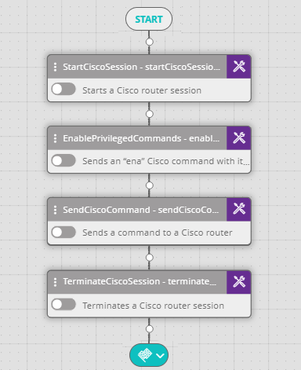

## Activity Description

Sends a command to a Cisco router (e.g., "show run").

## Output

The output of the command

## Settings

* **Cisco Session** – the session to which to send the command.
* **Command** – the command to send.  
   Example: `show run`

The following image depicts a typical Cisco Workflow sequence using the Send Cisco Command Activity:

