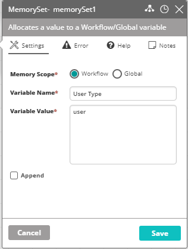

## Activity Description

Advanced Communicate Activity is used to assign a person to handle the event or the Incident that triggered the Workflow. It contacts all the recipients in the list, one by one, until one of them takes responsibility for the Incident that triggered the Workflow and is assigned to handle it. The person who takes responsibility for the Incident is displayed in the NG Dashboard under the Incident. Advanced Communicate Activity is similar to Communicate Activity, only each setting parameter of the Activity may also be a Variable.

## Output

* `%communicate.username%`: the name of the user who took responsibility for the Incident.
* `%communicate.userfullname%`: the full name of the user who took responsibility for the incident.

## Settings

* **Email Module** – (Only applicable if **Channel** is set to **Email** or **All**) Select the module instance that will provide the email functionality. Do either of the following:
   * Select the module instance from the drop-down list.
     :::note
     Only module instances that you have [write access](../../Product-Navigation/Configuration/Integrations-and-Modules/access-control-on-integrations-and-modules.mdx) to appear in the list.
     :::
   * Enter a reference to a variable (like `%moduleName%`) that contains the module instance name.  
     In case the variable value is empty, the activity attempts to use the default module instance of that type. If the value is not an actual instance name, the activity returns an error.
     :::caution
     Passing a module instance name as a variable allows the use of any module instance even if it doesn't give write permissions to the current user.
     :::
* **Single message** – determines whether all recipients get the same message or each of them is contacted with an individually defined message.
* **Notify all recipients upon assignment** – notifies all recipients that had already been contacted (including the one assigned to the Incident) upon user assignment.
* **Message**:
   * **Message Type** – the type of message sent to the recipient:  
      * **Original** – the message that triggered the Workflow.  
      * **Custom** – any entered free text.  
      * **Template** – a predefined message.
   * **Template Name** – the selected message template.  
     :::note
     Message templates are created via VAR::PRODUCT_FULL General Repository. For additional information on message templates, refer to the [Message Templates](../../Product-Navigation/Repository/General/Message-Templates.mdx).
     :::
* **Notifications Steps**:
   * **Type** – determines whether to contact a specific User, a group of users, or a variable type.  
   :::note
   If no groups are peresent in Actions, the **Group** option is not available in the table.
   :::
   :::note
   To use a variable that represents the type of contact (Group/User) use the following convention: `%Type%` (e.g., `%UserType%`). In this case the value is derived from a variable set in Memory Set Activity, as depicted in the following image:  
   
   :::
   * **Name** – the name of the User/Group or the name of the variable representing one of the options (e.g., `%UserType%`).
   * **Chanel** – the means of communication by which the recipient is contacted: **Email**, **SMS**, or **All** (for both email and SMS).
   :::note
   To use a variable that represents the communication method use the following convention: `%Type%` (e.g., `%email%`).
   :::
   * **Reply Time** – the time frame in which the current recipient may respond and after which escalation is performed and the next recipient is contacted to handle the Incident.  
   :::note
   To use a variable that represents the Reply Time value use the following convention: `%Type%` (e.g., `%replyTime%`).
   :::
   * **Advanced Options**:
      * **Time Frame** – the time in the day in which the selected recipient may be contacted.  
      :::note
      Time frames are defined via Actions General Repository. For additional information on Time Frames, refer to the [Time Frame](../../Product-Navigation/Repository/General/Time-Frames.mdx).
      :::
      :::note
      To use a variable that represents the time frame use the following convention: `%Type%` (e.g., `%timeframe%`).
      :::
      * **Show Assignment** – Determines whether to display the currently contacted recipient under the **Assign** column in Resolve Actions Dashboard.  
      :::note
      For additional information on Resolve Actions Dashboard, refer to the [Understanding Actions Live](../../Product-Navigation/Home-Page/Actions-LIVE/understanding-actions-live.mdx).
      :::
      * **Group One by One** – when a Group is selected, determines whether all Users in the Group are contacted simultaneously or they are contacted one by one until one of them is assigned to handle the Incident. The timeout defined will determine the time passing between one contact attempt and another.
      * **Recovery Notification** – adds the selected recipient to the recovery list. When the Incident is recovered, the recipients in the recovery list are notified.
      * **Message**:
        :::note
        When **Single message** is not selected, an individual message should be set for each and every recipient, else this should be edited only once.
        :::
        * **Method** – the type of message sent to the recipient:  
          * **Original** – the message that triggered the workflow.  
          * **Custom** – any entered free text.  
          * **Template** – a predefined message.
        * **Template Name** – the selected message template  
         :::note
         Message templates are created via VAR::PRODUCT General Repository. For additional information on message templates, refer to the [Message Templates](../../Product-Navigation/Repository/General/Message-Templates.mdx).
         :::