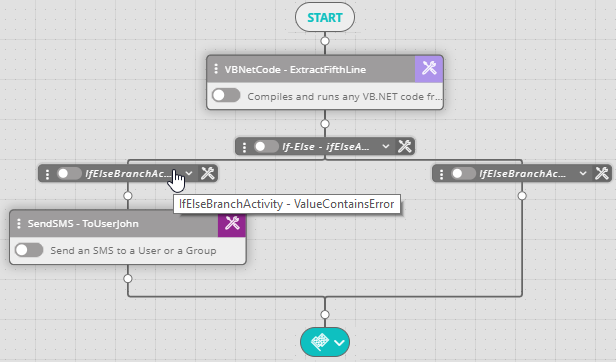

## Activity Description

Compiles and runs any VB.NET code fragment.

## Settings

* **Language type** – The coding language type.
* **Code name** – The name of the code fragment.
  :::note
  To use an existing code fragment, select it from the **Code Name** drop-down list.
  :::
* **Code Description** – The description of the code fragment.
* **Assembly List** – The list of external dll files used within the code fragment. By default, the assembly list contains several dll files. You may extend the list by importing additional dll files and use them within the code.

:::note
The imported dll files must exist in the machine where the Actions Executor is installed, in the specified path.
:::

:::note
To import the dll files you must have the MS ILMerge utility installed on your machine. If you do not have it installed, click the plus icon to get the instructions for the installation procedure.
:::

:::note
The VB.NET code fragment function signature must remain a Dictionary (of String, Object) and must return value of a variable of the same type.
:::

:::note
Two functions can be used to access variables within the code fragment:
* `GetWorkflowMemoryNodeData ("<VarName>")`
* `SetWorkflowMemoryNodeData ("<VarName>", "<Value>")`
:::

:::note
When creating new variables via the code activity, they can be used in other activities only by setting them to the workflow's memory.
:::

The following image depicts a typical VBNetCode activity flow:

