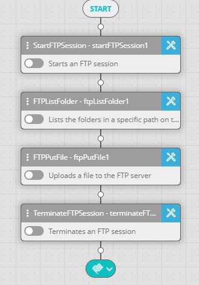

FTP activities allow you to manage FTP Server contents: create folders and files, delete them, upload contents to the FTP server and download contents from it.

In a typical FTP workflow, you start an FTP session, get the desired information or upload any file to the FTP server, and then terminate the FTP session. Each FTP activity between the Start FTP Session activity and Terminate FTP Session activity should refer to the started session's name.

The following image depicts a typical FTP workflow:

