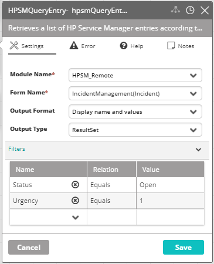

## Activity Description

Retrieves a list of HP Service Manager entries according to the selected criteria.

## Output

A ResultSet of all matching entries.

## Settings

* **Module Name** – The HPSM module with which the Activity is associated.
* **Form Name** – The name of the HPSM form.
* **Output Format** – The format of the form.
* **Output Type** – The output type of the form.
* **Filters** – The rules by which to extract the matching alerts. You can add new filters to the list, or edit existing ones.

