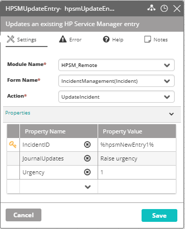

## Activity Description

Updates an existing HP Service Manager entry.

## Output

Success/Failure.

## Settings

* **Module Name** – The HPSM module with which the activity is associated.
* **Form Name** – The name of the HPSM form.
* **Action** – The type of action to perform (the list of optional actions according to the selected form). For example: UpdateIncident, CloseIncident, ResolveIncident.
* **Properties** – Optional properties to add fields to the list, edit or remove them.

