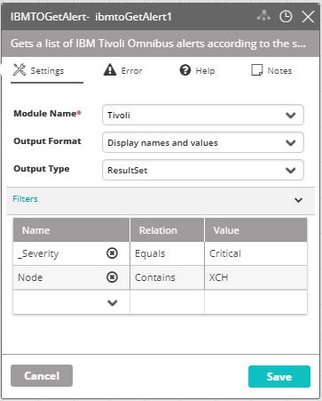

## Activity Description

Gets a list of IBM Tivoli Omnibus alerts according to the selected criteria.

## Output

A ResultSet or json message of all matching records.

## Settings

* **Module Name** – The name of the IBMTO module in VAR::PRODUCT_FULL Modules.
* **Output Format** – Select the output format of how you’d like to see the values displayed.
* **Output Type** – Select the output type you’d like to see the values displayed in.
* **Filters** – The rules by which to extract the matching alerts (click **Add** to add filters to the list, and click **Edit** to modify the existing filters). Filters for this activity should be as specific as possible.

:::note
Selection box values can only be used with the Equals/Not Equals operators.
:::

