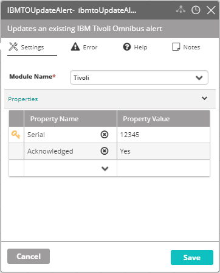

## Activity Description

Updates an existing IBM Tivoli Omnibus alert.

## Output

Success/Failure.

## Settings

* **Module Name** – The name of the IBMTO Module in VAR::PRODUCT_FULL Integration Module.
* **Properties** – The properties to add to the record or remove from it.

:::note
The key icon next to a field specifies the field that will be used as a primary key. The default key for Omnibus updates should be Serial, as shown below. Check or uncheck a field as a primary key by double-clicking the location of the key icon.
:::

