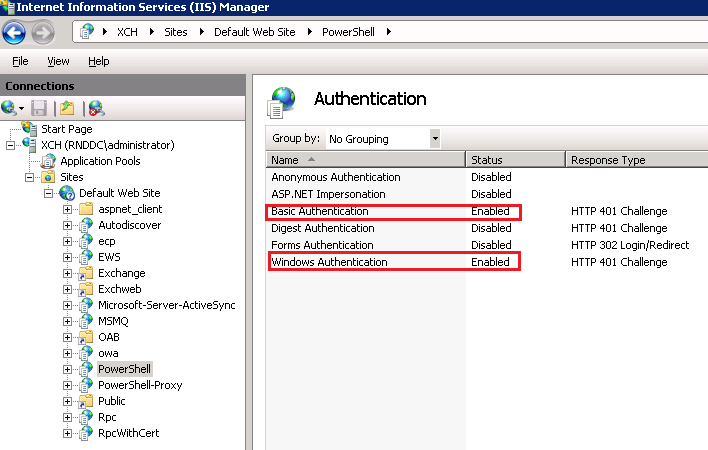

MS Exchange activities are used to perform changes in an MS Exchange Server.

:::note
All Exchange activities operate using the Exchange Powershell commands.
:::

:::note
To use the Microsoft Exchange activities, first verify that both Basic Authentication and Windows Authentication are enabled in the Exchange server's Powershell configuration, as depicted in the following image:

:::