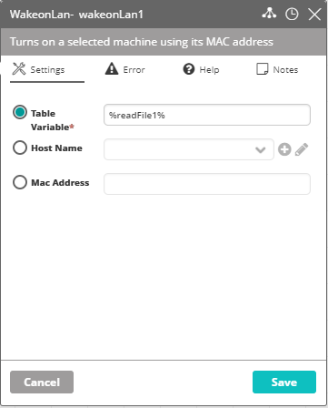
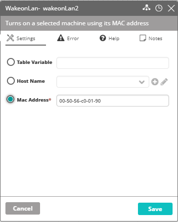
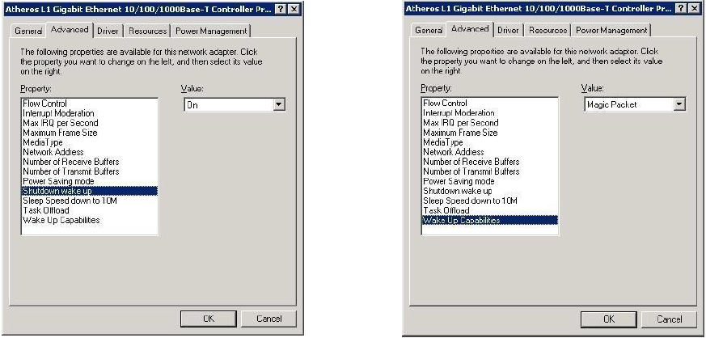

## Activity Setup

### Activity Description

Turns on a selected machine according to its MAC address.

### Output

Success/Failure

### Settings

* **Table Variable** – The name of the ResultSet which holds the MAC address/s of the machine/s to start.
* **Host Name** – The name of the machine to start.  
  :::note
  When selecting this option, you must verify that the selected device is assigned a MAC address.
  :::
* **Mac Address** – The MAC address of the machine to start.

The following image depicts a Wake-on-Lan activity that starts a machine according to a ResultSet name.

The following image depicts a Wake-on-Lan activity that starts a machine according to its MAC address.

## Using Wake-on-Lan with VAR::PRODUCT_FULL

Wake-on-Lan (WOL) is an Ethernet computer networking standard that allows a computer to be turned on by a network message.

Actions command line installed on Windows machines is a client which connects to Actions server using port 11000.

### BIOS Settings

There are various settings in the computer BIOS that may need to be configured before remote wake-up can be performed. Usually it can be located and enabled under Power Management section in the motherboard's BIOS setup page.

**LAN Adapter Settings**

WOL settings must be enabled on your Ethernet adapter. To do so:

1. Access the Device Manager's network card's device properties.
2. Enable all Wake-on-Lan related features.

:::note
This WOL feature is only supported by Ethernet network cards, you cannot apply WOL feature to wireless adapter.
:::
:::note
The WOL feature is named differently on different pages of network card (if supported), as depicted in the following images:

:::