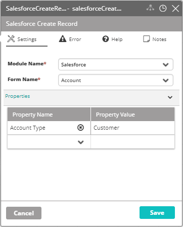

## Activity Description

Creates a new record in Salesforce.

## Output

A record in Salesforce.

## Settings

* **Module Name** - The name of the Salesforce module in VAR::PRODUCT_FULL.
* **Form Name** - The name of the Salesforce form (Account/Lead).
* **Properties** - The properties to add to the new record. You can add the desired fields in the Property Name column, and their associated values in the Property Value column.

