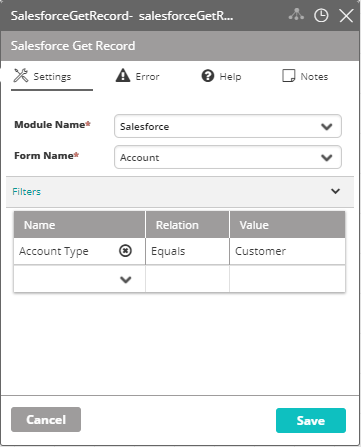

## Activity Description

Gets an existing record from Salesforce.

## Output

A record from Salesforce.

## Settings

* **Module Name** - The name of the Salesforce module in VAR::PRODUCT_FULL.
* **Form Name** - The name of the Salesforce form (Account/Lead).
* **Optional Filters** - The filters to get the desired record. You can add the desired fields in the Name column, select their associated relation in the Relation column, and add their associated values in the Value column.

