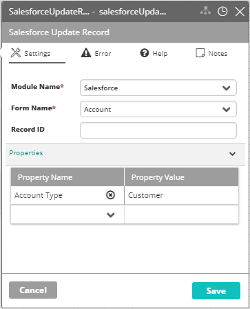

## Activity Description

Updates an existing record in Salesforce.

## Output

An updated record in Salesforce.

## Settings

* **Module Name** - The name of the Salesforce module in VAR::PRODUCT_FULL.
* **Form Name** - The name of the Salesforce form (Account/Lead).
* **Record ID** - The ID of the Salesforce's record that should be updated.
* **Properties** - The properties to add to the updated record. You can add the desired fields in the Property Name column, and their associated values in the Property Value column.

