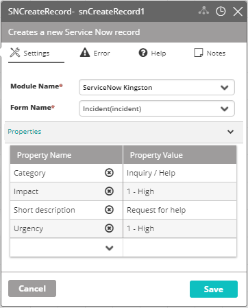

## Activity Description

Creates a new ServiceNow record.

## Output

The ID of the new record.

## Settings

* **Module Name** – The name of the ServiceNow Module in VAR::PRODUCT_FULL.
* **Form Name** – The name of the ServiceNow form.
* **Properties** – The properties to add to the Properties section or remove from it. Field names are values to be used to create the new record.

