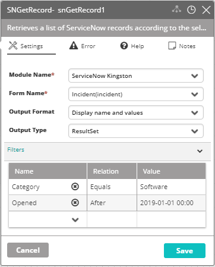

## Activity Description

Retrieves a list of ServiceNow records according to the selected criteria.

## Output

A resultSet or JSON message of all matching records.

## Settings

* **Module Name** – The name of the ServiceNow module in VAR::PRODUCT_FULL.
* **Form Name** – The name of the ServiceNow form.
* **Output Format** – The output format of the list of records to be retrieved.
* **Output Type** – The output type of the list of records to be retrieved.
* **Filters** – The rules by which to extract the matching records (click **Add** to add filters to the list, and click **Edit** to modify the existing filters).

:::note
Filters are applied (by the activity) to records which contain values in the specified field.
:::

:::note
Since retrieving the translation of the fields’ data from ServiceNow might take a while, it is recommended that the filters of this activity are as specific as possible.
:::

