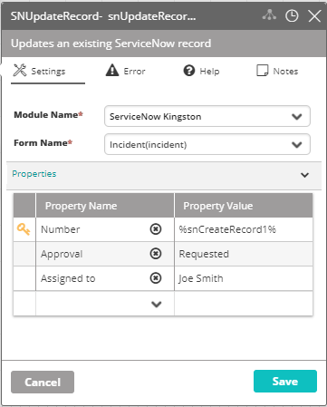

## Activity Description

Updates an existing record in ServiceNow.

## Output

Success/Failure

## Settings

* **Module Name** – The name of the ServiceNow module in VAR::PRODUCT_FULL.
* **Form Name** – The name of the ServiceNow form.
* **Properties** – The properties to add to the Properties section or remove from it. Field names are values to be used to create the new record.

:::note
The key icon next to a field specifies the field that will be used as a primary key. The default key is the "Number" field (which is a mandatory property). Check or uncheck a field as a primary key by double-clicking the location of the key icon.
:::

:::note
To update a "checkbox" type field, set its value to true/false.
:::

