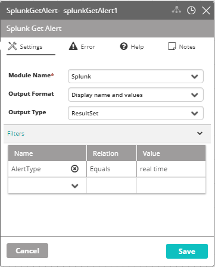

## Activity Description

Gets a list of Splunk alerts according to the selected criteria.

## Output

A result set or json message of all matching alerts.

## Settings

* **Module Name** – The name of the Splunk Module in VAR::PRODUCT_FULL.
* **Output Format** – Select the Output Format depending on how you'd like to see the values displayed.
* **Output Type** – Select the Output Type depending on how you'd like to see the values displayed.
* **Filters** – Applied (by the activity) to alerts that contain values in the specified field. Since retrieving the translation of fields' data from Splunk might take a while, it's recommended that the filters of this activity are as specific as possible.

