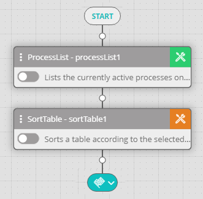
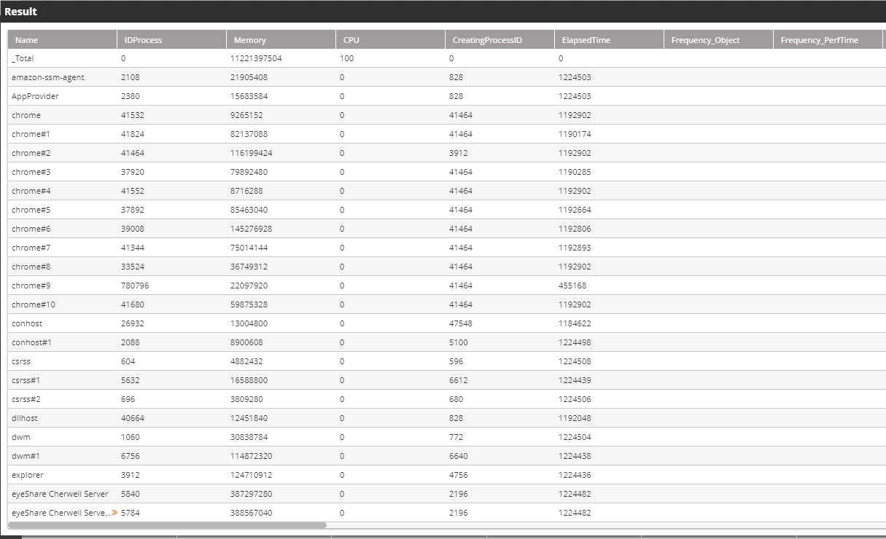
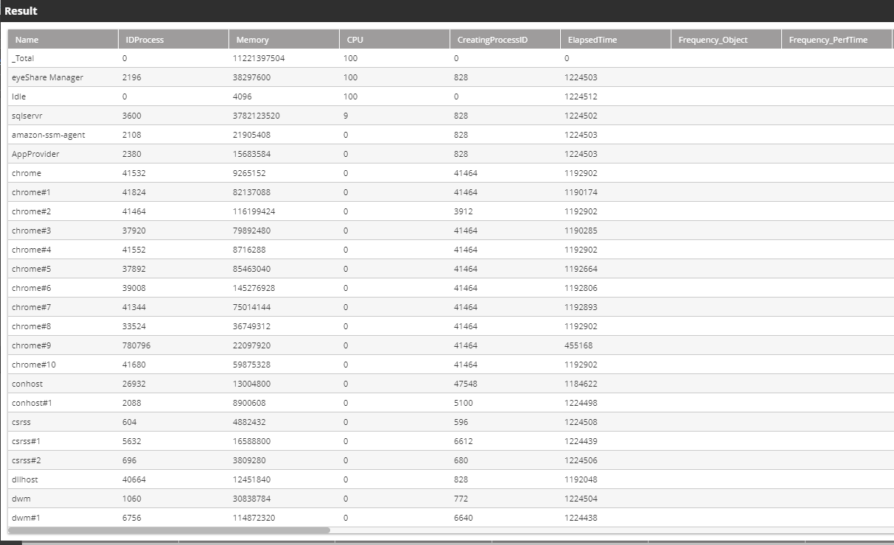

## Activity Description

Sorts a selected table according to the selected column name or column number (the Activity can be used, for example, to get the oldest/newest file or folder or to get the smallest/largest file within a folder).

## Output

The sorted table.

## Settings

* **Table Variable** – The name of the table (variable names must follow the convention %Variable&).
* **Use column names/Use column numbers** – Determines whether to sort the table according to a column name or a column number.
* **Column Name** – The column name/number according to which sorting is performed.  
  :::note  
  To use spaces within a column name, put the name inside square brackets (e.g., `[CPU Usage]`).
  :::
* **Sort Order** – Determines whether the order of the sorted table is ascending or descending.

The following image depicts a Sort Table Activity following a Process List Activity:

The initial output of the Process List Activity is depicted below:

The sorted output of the Sort Table Activity is depicted below:

