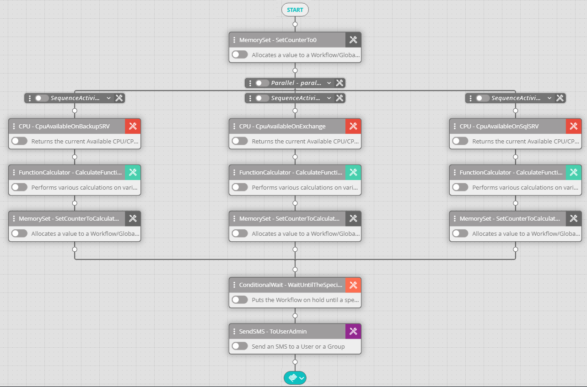

## Activity Description

Puts the workflow on hold until a specified condition applies.

## Settings

* **Formula** – The condition that must apply for the workflow to continue (e.g., %counter% = 5).
* **Maximum Timeout** – Check in order to set the maximum timeout.
* **Default Time Format/Use Variable** – Determines whether to use a constant time value or a variable. Default Time Format uses the timeout listed in the activity; by default this is one minute for most activities.
* **Time Interval** – If you elected to use a variable time value, set the time unit that the variable represents.
* **Time** – The name of the variable holding a numeric value.

The following image depicts a workflow in which the conditional Wait activity is set to wait until a counter exceeds the value "3". This way, each of the activities residing under the parallel activity must terminate before the workflow proceeds to the next activity:

