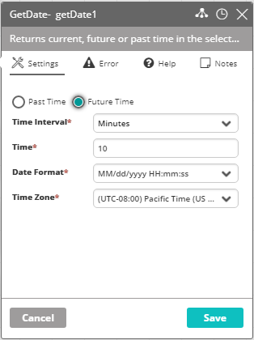
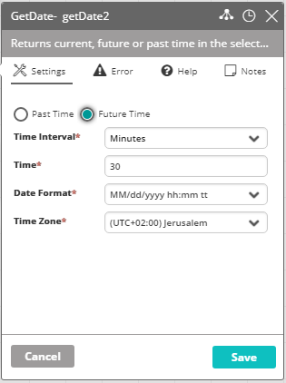

## Activity Description

Returns current, future, or past time in the selected format, in a specific time zone (can be used, for example, to get the exact time 10 minutes ago or the day in the week in two days now).

* **Past Time/Future Time** – Determines whether the required timestamp belongs to the past or the future time.
* **Time Interval** – The time units to subtract/add.
* **Time** – The amount of seconds/minutes/hours/days to subtract or add from/to the current time.
* **Date Format** – The format in which to return the past/future time.
* **Time Zone** – The time zone to which the past/future time belongs (you may ask, for example, what was the time 5 hours ago in a **different** time zone than the one in which the workflow is running).

In the following example, if the current time is 06/30/2019 15:50 then Actions returns 06/30/2019 13:00:

In the following example, if the current date is 06/30/2019 3:50 PM then Actions return 06/30/2019 11:20 PM:

