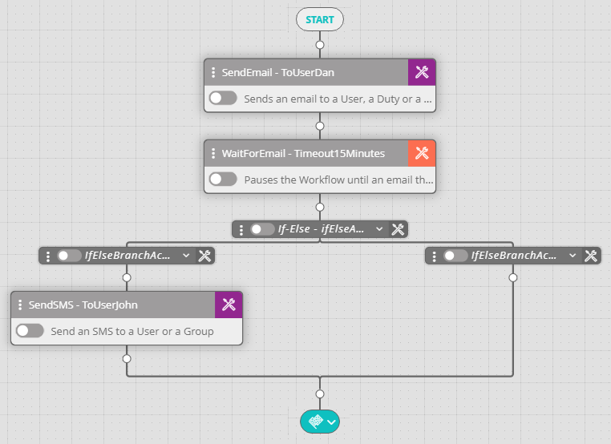
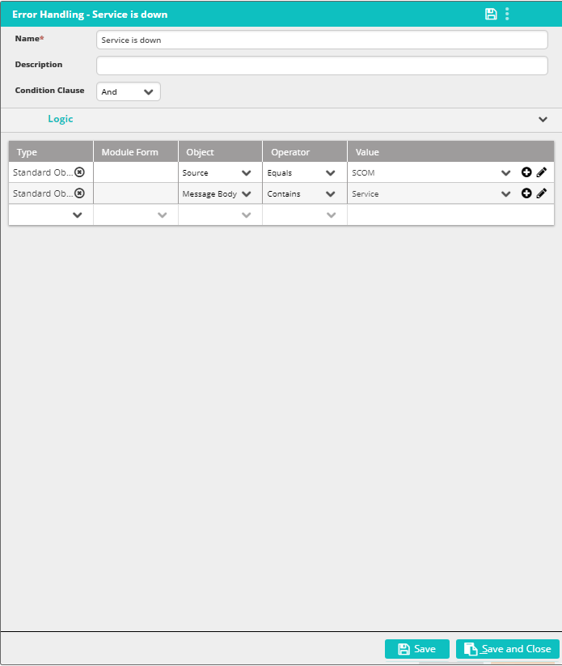

## Activity Description

Pauses the workflow until an email is received.

:::note
This activity must be followed by an If-Else Activity in which a custom condition refers to the received email.
:::

## Settings

* **Default Time Format/Use Variable–** Determines whether to use a constant time value or a variable. Default Time Format uses the timeout listed in the activity; by default this is one minute for most activities.
* **Time Interval** – If you elected to use a variable time value, set the time unit that the variable represents.
* **Time** – The name of the variable holding a numeric value.

The following image depicts a typical WaitForEmail activity flow:

The following image displays a condition used within an If-Else Activity used within a typical Wait for Email Activity flow:

:::note
To refer to the incoming email information, use the following syntax:

%waitForEmail1.body%

%waitForEmail1.source%

%waitForEmail1.subject%

%waitForEmail1.username%

%waitForEmail1.userfullname%
:::