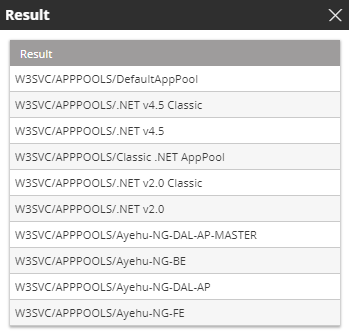

## Activity Description

Retrieves a list of application pools on a selected machine.

:::note
Application Pool activities require IIS 6 backward compatibility.
:::

## Output

Stopped/Running

## Settings

* **Host Name** – The host name or IP address.
* **User Name** – If required, the username of an account that has read-write access to the host.
* **Password** – If required, the password of the account listed in the User Name field.

The following image depicts the output of an Application Pool List Activity:

