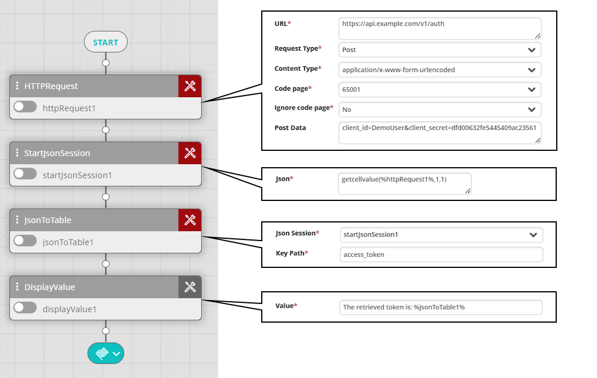

## Activity Description

Sends an HTTP request (including headers).

## Output

The request's result.

## Settings
- **URL**—The website's address (e.g. `https://www.example.com`). The address must include the protocol prefix (`https://` or `http://`) and any query parameters that you want to include.
- **User Name**—The username by which the selected website is accessed (optional, usually not required).
- **Password**—The password by which the selected website is accessed (optional, usually not required).
- **Request Type**—HTTP method to use (GET/POST/PUT/DELETE/PATCH).
- **Content Type**—(Only for POST, PATCH, and PUT) The format of the posted request. Select from the list of frequently used content types or type your own. Example: `application/x-www-form-urlencoded`.
- **Code Page**—For plain-text content types such as text/html and text/plain, this setting specifies the character encoding using code page numbers. Enter any code page number or use the drop-down list to select from a list of frequently used code pages. For example, to set UTF-31, enter 12000. If left empty, 65001 (UTF-8) is used. For the full list of possible code pages, see the [Microsoft Documentation](https://docs.microsoft.com/en-us/dotnet/api/system.text.encoding?view=net-5.0#list-of-encodings).
- **Ignore Code Page**—Ignores the value of **Code Page** and uses the default encoding 65001 (UTF-8).
- **Post Data**—The request body (depending on the selected **Content Type**) in raw format.
- **Headers**—The list of headers to post to the web service.
  - **Header**—The header name.
  - **Value**—The header value without any surrounding quotes.
- **Proxy**—Enter the connection details of a proxy server if you want to use one:
  - **Proxy**—The address of the proxy server that must be passed to reach the website (e.g., 192.168.10.10).
  - **User Name**—A username authorized to access the proxy server (e.g., admin).
  - **Password**—The password of the user authorized to access the proxy server.
  - **Security Protocol Type**—The type of the security protocol can be SSL3/TLS/TLS11/TLS12 (the default is None).
  - **Certificate Validation Callback**—Used to pass the certificate request in order to retrieve information (SSL pages).

The following example shows a workflow that uses the HTTP Request activity to authenticate against an external service (unused activity fields are omitted). After posting a client ID and a client secret, it receives a JSON reply with an access token. The example then uses the `getcellvalue()` function to create a JSON session using the Start Json Session activity. The Json to Table activity then converts the JSON code to a memory able and extracts a property called `access_token` from the JSON. Finally, the Display Value activity prints a message including the retrieved access token in the workflow log.

