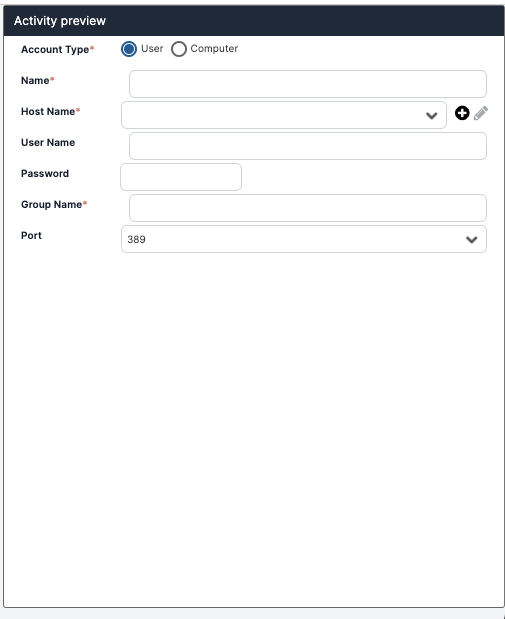

## Backend Code Examples

This guide will take you through some backend code examples created with the Activity Designer. Under each example, you will find code that you can copy and modify and an example of the UI created by the code.

### Active Directory Add to Group Activity
In this example, you'll add the backend code to an *Active Directory Add to Group* activity. To access the JSON code for the frontend code to design the UI for this activity, visit the [Guide: Frontend Code in the Activity Designer](./Activity---

<details>
<summary>Backend: Visual Basic</summary>

```
Imports Ayehu.Sdk.ActivityCreation.Interfaces
Imports Ayehu.Sdk.ActivityCreation.Extension
Imports System.Text
Imports System
Imports System.Data
Imports System.IO
Imports Microsoft.VisualBasic
Imports System.DirectoryServices
Imports System.Net

Namespace Ayehu.Sdk.ActivityCreation
    Public Class ActivityClass
        Implements IActivity


        Private Const DefaultAdPort As String = "389"
        Public HostName As String
        Public UserName As String
        Public Password As String
        Public ADUserName As String
        Public ADGroupName As String
        Public AccountType As String
        Public SecurePort As String

        Public Function Execute() As ICustomActivityResult Implements IActivity.Execute


            Dim dt As DataTable = New DataTable("resultSet")
            dt.Columns.Add("Result", GetType(String))

            If String.IsNullOrEmpty(SecurePort) = True Then
                SecurePort = DefaultAdPort
            End If

            If IsNumeric(SecurePort) = False Then
                Dim msg As String = "Port parameter must be number"
                Throw New ApplicationException(msg)
            End If


            Dim accntType As String = "user"
            If String.IsNullOrEmpty(AccountType) = False Then
                accntType = AccountType
            End If

            Dim userDirectoryEntry As DirectoryEntry
            Dim adminDirectoryEntry As DirectoryEntry
            Dim userFQDN = ADUserName.Split("\")


            If userFQDN.Length = 2 Then
                userDirectoryEntry = GetAdEntry(userFQDN(0), SecurePort, UserName, Password)
                adminDirectoryEntry = GetAdEntry(HostName, SecurePort, UserName, Password)
            Else
                userDirectoryEntry = GetAdEntry(HostName, SecurePort, UserName, Password)
                adminDirectoryEntry = userDirectoryEntry
            End If


            Dim userDirectorySearcher As DirectorySearcher = New DirectorySearcher(userDirectoryEntry)


            Select Case LCase(accntType)
                Case "user"
                    userDirectorySearcher.Filter = "(&(objectClass=user)(!(objectclass=computer))(SamAccountName=" + ADUserName + "))"
                    If (userFQDN.Length = 2) Then
                        userDirectorySearcher.Filter = "(&(objectClass=user)(!(objectclass=computer))(SamAccountName=" + userFQDN(1) + "))"
                    End If
                Case "computer"
                    userDirectorySearcher.Filter = "(&(objectClass=computer) (sAMAccountname=" + ADUserName + "$))"
                    If (userFQDN.Length = 2) Then
                        userDirectorySearcher.Filter = "(&(objectClass=computer) (sAMAccountname=" + userFQDN(1) + "$))"
                    End If
            End Select


            userDirectorySearcher.SearchScope = SearchScope.Subtree
            Dim results As SearchResult = userDirectorySearcher.FindOne()
            If results IsNot Nothing Then
                Dim groupDirectorySearcher As DirectorySearcher = New DirectorySearcher(adminDirectoryEntry)
                groupDirectorySearcher.Filter = "(&(objectClass=group) (sAMAccountName=" + ADGroupName + "))"
                groupDirectorySearcher.SearchScope = SearchScope.Subtree
                Dim resultsGroup As SearchResult = groupDirectorySearcher.FindOne()
                If resultsGroup IsNot Nothing Then
                    Dim degroup As DirectoryEntry = GetAdEntryByFullPath(resultsGroup.Path, UserName, Password)
                    Dim TempPath As String = LCase(results.Path)
                    degroup.Properties("member").Add(LCase(TempPath.Substring(TempPath.IndexOf("cn"))))
                    degroup.CommitChanges()
                    degroup.Close()
                Else
                    Throw New Exception("Group does not exist")
                End If
            Else
                Select Case LCase(accntType)
                    Case "user"
                        Throw New Exception("User does not exist")
                    Case "computer"
                        Throw New Exception("Computer does not exist")
                End Select
            End If
            dt.Rows.Add("Success")
            userDirectoryEntry.Close()
            adminDirectoryEntry.Close()

            Return Me.GenerateActivityResult(dt)

        End Function

        Public Function GetAdEntryByFullPath(ByVal path As String, ByVal userName As String, ByVal password As String) As DirectoryEntry
            Dim adEntry = New DirectoryEntry(path, userName, password, AuthenticationTypes.Secure)
            Return adEntry
        End Function


        Public Function GetAdEntry(ByVal domainServer As String, ByVal domainPort As String, ByVal username As String, ByVal password As String) As DirectoryEntry
            Dim defaultAdSecurePort As String = "636"
            If domainPort.Equals(defaultAdSecurePort) AndAlso IsIpAddress(domainServer) Then Throw New Exception("When using a secure port, a server domain name must be defined for the device.")
            Dim domainUrl As String = "LDAP://" & domainServer

            If Not domainPort.Equals(DefaultAdPort) Then
                domainUrl = domainUrl & ":" & domainPort
            End If

            Dim adEntry = New DirectoryEntry(domainUrl, username, password, AuthenticationTypes.Secure)
            Return adEntry
        End Function

        Private Function IsIpAddress(ByVal domainServer As String) As Boolean
            Dim address As IPAddress
            Return IPAddress.TryParse(domainServer, address)
        End Function


    End Class
End Namespace

```

</details>

<details>
<summary>Frontend: UI</summary>

 

</details>

### Max Function Activity
In this example, you'll create an Activity that returns the higher of two numbers using VB.

<details>
<summary>Backend: Visual Basic</summary>

```
Imports Ayehu.Sdk.ActivityCreation.Interfaces
Imports Ayehu.Sdk.ActivityCreation.Extension
Imports System.Text
Imports System
Imports System.Xml
Imports System.Data
Imports System.IO
Imports System.Collections.Generic
Imports Microsoft.VisualBasic

Namespace Ayehu.Sdk.ActivityCreation
    Public Class ActivityClass
        Implements IActivity


        Public TheValue As String
        Public TheValue2 As String

        Public Function Execute() As ICustomActivityResult Implements IActivity.Execute


            Dim dt As DataTable = New DataTable("resultSet")
            dt.Columns.Add("Result", GetType(String))


            dt.Rows.Add(Math.Max(Convert.ToDecimal(TheValue), Convert.ToDecimal(TheValue2)))

            Return Me.GenerateActivityResult(dt)
        End Function


    End Class
End Namespace

```

</details>

<details>
<summary>Frontend: JSON</summary>

```
{
  "data": {
    "name": "Max",
    "description": "Returns the larger of two unsigned integers.",
    "Timeout": "00:01:00",
    "class": [],
    "rootSettings": {
      "isCollapse": false,
      "activitySettings": [
        {
          "key": "TheValue",
          "label": "First Value",
          "baseType": "control",
          "labelKey": "FIRST_VALUE",
          "controlType": "textbox",
          "value": "",
          "required": true
        },
        {
          "key": "TheValue2",
          "required": true,
          "label": "Second Value",
          "labelKey": "SECOND_VALUE",
          "baseType": "control",
          "controlType": "textbox",
          "value": ""
        }
      ],
      "index": "1",
      "label": "main",
      "labelKey": null
    }
  }
}
```

</details>

### Box Copy File
In this example, you'll create an activity with C# that creates a copy of a file in another folder on Box. 

<details>
<summary>Backend: C#</summary>

```
using Ayehu.Sdk.ActivityCreation.Interfaces;
using Ayehu.Sdk.ActivityCreation.Extension;
using System.IO;
using Box.V2.Config;
using Box.V2.JWTAuth;
using Box.V2.Models;
using System;
using System.Threading.Tasks;

namespace Ayehu.Sdk.Box
{
    public class CopyFile : IActivityAsync
    {
        public string FolderID;
        public string FileID;
        public string Name;
        public string Version;
        public string USER_ID;
        public string CLIENT_ID;
        public string CLIENT_SECRET;
        public string ENTERPRISE_ID;
        public string JWT_PRIVATE_KEY_PASSWORD;
        public string JWT_PUBLIC_KEY_ID;
        public string PRIVATE_KEY;
        public async Task<ICustomActivityResult> Execute()
        {
            var Message = string.Empty;
            var boxConfig = new BoxConfig(CLIENT_ID, CLIENT_SECRET, ENTERPRISE_ID, PRIVATE_KEY, JWT_PRIVATE_KEY_PASSWORD, JWT_PUBLIC_KEY_ID);
            var boxJWT = new BoxJWTAuth(boxConfig);
            var adminToken = boxJWT.UserToken(USER_ID);
            var adminClient = boxJWT.AdminClient(adminToken);
            var requestParams = new BoxFileRequest()
            {
                Id = FileID,
                Parent = new BoxRequestEntity()
                {
                    Id = FolderID
                },
                Name = Name
            };
            BoxFile fileCopy = await adminClient.FilesManager.CopyAsync(requestParams);
            Message = "Success";
            return this.GenerateActivityResult(Message);
        }
    }
}
```
</details>

<details>
<summary>Backend: JSON</summary>

```
{
  "data": {
    "name": "Copy File",
    "description": "Copy a file to a specified folder in Box.",
    "Timeout": "00:01:00",
    "class": [],
    "rootSettings": {
      "isCollapse": false,
      "activitySettings": [
        {
          "value": "",
          "required": true,
          "key": "FolderID",
          "label": "Folder ID",
          "labelKey": "FOLDER_ID",
          "baseType": "control",
          "controlType": "textbox"
        },
        {
          "value": "",
          "required": true,
          "key": "FileID",
          "label": "File ID",
          "labelKey": "FILE_ID",
          "baseType": "control",
          "controlType": "textbox"
        },
         {
          "value": "",
          "required": true,
          "key": "Version",
          "label": "Version",
          "labelKey": "VERSION",
          "baseType": "control",
          "controlType": "textbox"
        },
        {
          "value": "",
          "required": false,
          "key": "Name",
          "label": "Name",
          "labelKey": "NEW_FILE_NAME",
          "baseType": "control",
          "controlType": "textbox"
        },
        {
          "value": "",
          "required": true,
          "key": "USER_ID",
          "label": "User ID",
          "labelKey": "USER_ID",
          "baseType": "control",
          "controlType": "textbox"
        },
        {
          "value": "",
          "required": true,
          "key": "CLIENT_ID",
          "label": "Client ID",
          "labelKey": "CLIENT_ID",
          "baseType": "control",
          "controlType": "textbox"
        },
        {
          "value": "",
          "required": true,
          "key": "CLIENT_SECRET",
          "label": "Client Secret",
          "labelKey": "CLIENT_SECRET",
          "baseType": "control",
          "controlType": "password"
        },
        {
          "value": "",
          "required": true,
          "key": "ENTERPRISE_ID",
          "label": "Enterprise ID",
          "labelKey": "ENTERPRISE_ID",
          "baseType": "control",
          "controlType": "textbox"
        },
        {
          "value": "",
          "required": true,
          "key": "JWT_PRIVATE_KEY_PASSWORD",
          "label": "JWT Password Key",
          "labelKey": "PRIVATE_KEY_PASSWORD",
          "baseType": "control",
          "controlType": "password"
        },
        {
          "value": "",
          "required": true,
          "key": "JWT_PUBLIC_KEY_ID",
          "label": "JWT Public Key ID",
          "labelKey": "PUBLIC_KEY_ID",
          "baseType": "control",
          "controlType": "textbox"
        },
        {
          "value": "",
          "required": true,
          "key": "PRIVATE_KEY",
          "label": "Private Key",
          "labelKey": "PRIVATE_KEY",
          "baseType": "control",
          "controlType": "textarea"
        }
      ],
      "index": "1",
      "label": "main",
      "labelKey": null
    }
  }
}
```

</details>

