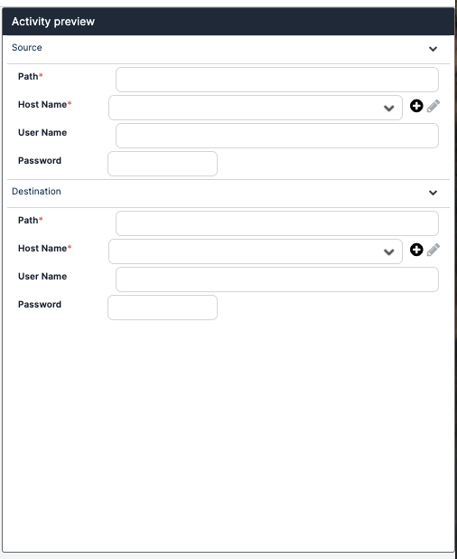
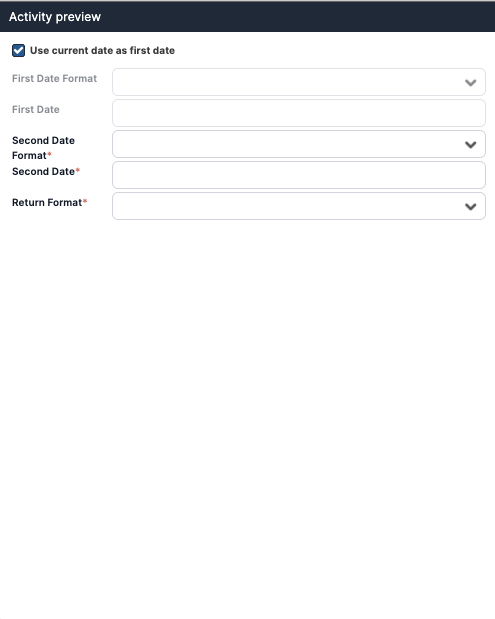

## Frontend Code Examples

This guide will take you through some full frontend code examples created with the Activity Designer. Under each example, you will find code that you can copy and modify and an example of the UI created by the code.

### Active Directory Add to Group Activity
In this example, you'll use the **"hostGroup"** Base type to create the frontend of an *Active Directory Add to Group* activity.

<details>
<summary>JSON Code</summary>

```
 {
  "data": {
    "name": "AD Add to Group",
    "description": "Active Directory add to group.",
    "Timeout": "00:01:00",
    "class": [],
    "rootSettings": {
      "isCollapse": false,
      "activitySettings": [
        {
          "value": "User",
          "required": true,
          "key": "AccountType",
          "styleClass": "one-line",
          "label": "Account Type",
          "labelKey": "AD_ADD_TO_GROUP_ACCOUNT_TYPE",
          "baseType": "control",
          "controlType": "radiobutton",
          "valueChangesActions": {
            "User": {
              "setValue": {
                "AccountType": "User"
              }
            },
            "Computer": {
              "setValue": {
                "AccountType": "Computer"
              }
            }
          },
          "controlOptions": [
            {
              "label": "User",
              "value": "User"
            },
            {
              "label": "Computer",
              "value": "Computer"
            }
          ]
        },
        {
          "value": "",
          "required": true,
          "key": "ADUserName",
          "label": "Name",
          "labelKey": "AD_ADD_TO_GROUP_NAME",
          "baseType": "control",
          "controlType": "textbox"
        },
        {
          "value": "",
          "key": "hostGroup1",
          "label": "",
          "labelKey": "",
          "baseType": "hostGroup",
          "controlType": ""
        },
        {
          "value": "",
          "required": true,
          "key": "ADGroupName",
          "label": "Group Name",
          "labelKey": "AD_ADD_TO_GROUP_GROUP_NAME",
          "baseType": "control",
          "controlType": "textbox"
        },
        {
          "value": "389",
          "required": false,
          "key": "SecurePort",
          "disabled": false,
          "label": "Port",
          "styleClass": "",
          "labelKey": "AD_LIST_OU_SECUREPORT",
          "baseType": "control",
          "controlType": "autocomplete",
          "controlOptions": [
            {
              "key": "389",
              "value": "389"
            },
            {
              "key": "636",
              "value": "636"
            }
          ]
        }
      ],
      "index": "1",
      "label": "main",
      "labelKey": null
    }
  }
}
```

</details>

<details>
<summary>JSON Preview</summary>

 

</details>

### File Copy Activity
In this example, you'll use **"group"**, **"hostGroup**, and **"customKeys"** to create the activity **File Copy**.

<details>
<summary>JSON Code</summary>

```
{
  "data": {
    "name": "File Copy",
    "description": "Copy a File from a Source Location to a Destination Location.",
    "Timeout": "00:01:00",
    "class": [],
    "rootSettings": {
      "isCollapse": false,
      "activitySettings": [
        {
          "key": "source",
          "label": "Source",
          "baseType": "group",
          "labelKey": "FILE_COPY_SOURCE",
          "isCollapse": true,
          "isVisible": true,
          "styleClass": [
            "formGroup"
          ],
          "activitySettings": [
            {
              "value": "",
              "required": true,
              "key": "SrcPath",
              "disabled": false,
              "label": "Path",
              "styleClass": "",
              "labelKey": "SOURCE_FILE_COPY_PATH",
              "baseType": "control",
              "controlType": "textbox",
              "controlOptions": []
            },
            {
              "value": "",
              "required": false,
              "key": "newControl_1",
              "disabled": false,
              "label": "newControl",
              "styleClass": "",
              "labelKey": "newControl",
              "baseType": "hostGroup",
              "customKeys": {
                "hostName": "SrcHostName",
                "userName": "SrcUserName",
                "password": "SrcPassword",
                "hostId": "SrcHostId"
              },
              "controlType": "",
              "controlOptions": []
            }
          ]
        },
        {
          "key": "destination",
          "label": "Destination",
          "baseType": "group",
          "labelKey": "FILE_COPY_DESTINATION",
          "styleClass": [
            "formGroup"
          ],
          "isCollapse": true,
          "isVisible": true,
          "activitySettings": [
            {
              "value": "",
              "required": true,
              "key": "DstPath",
              "disabled": false,
              "label": "Path",
              "styleClass": "",
              "labelKey": "DESTINATION_FILE_COPY_PATH",
              "baseType": "control",
              "controlType": "textbox",
              "controlOptions": []
            },
            {
              "value": "",
              "required": false,
              "key": "newControl_2",
              "disabled": false,
              "label": "newControl",
              "styleClass": "",
              "labelKey": "newControl",
              "baseType": "hostGroup",
              "customKeys": {
                "hostName": "DstHostName",
                "userName": "DstUserName",
                "password": "DstPassword",
                "hostId": "DstHostId"
              },
              "controlType": "",
              "controlOptions": []
            }
          ]
        }
      ],
      "index": "1",
      "label": "main",
      "labelKey": null
    }
  }
}
```

</details>

<details>
<summary>JSON Preview</summary>



</details>

### Date Difference
In this example, you'll use **"valueChangesActions"** to create an activity that calculates the difference between two time stamps. 

<details>
<summary>JSON Code</summary>

```
{
  "data": {
    "name": "Date Difference",
    "description": "Returns the date difference between two dates.",
    "Timeout": null,
    "class": [],
    "rootSettings": {
      "isCollapse": false,
      "activitySettings": [
        {
          "key": "IsNowSelected",
          "label": "Use current date as first date",
          "baseType": "control",
          "labelKey": "DATE_DIFFERENCE_USE_CURRENT_DATE_AS_FIRST_DATE",
          "controlType": "checkbox",
          "value": "",
          "checked": true,
          "styleClass": "",
          "convertBoolTo": "number",
          "valueChangesActions": {
            "false": {
              "enable": [
                "FirstDateFormat",
                "FirstDate"
              ]
            },
            "true": {
              "disable": [
                "FirstDateFormat",
                "FirstDate"
              ],
              "setValue": {
                "FirstDateFormat": "",
                "FirstDate": ""
              }
            }
          }
        },
        {
          "value": "",
          "required": true,
          "key": "FirstDateFormat",
          "label": "First Date Format",
          "labelKey": "DATE_DIFFERENCE_FIRST_DATE_FORMAT",
          "styleClass": "",
          "baseType": "control",
          "controlType": "autocomplete",
          "controlOptions": [
            {
              "key": "MM/dd/yyyy",
              "value": "MM/dd/yyyy"
            },
            {
              "key": "dddd, dd MMMM yyyy HH:mm",
              "value": "dddd, dd MMMM yyyy HH:mm"
            },
            {
              "key": "dddd, dd MMMM yyyy hh:mm tt",
              "value": "dddd, dd MMMM yyyy hh:mm tt"
            },
            {
              "key": "dddd, dd MMMM yyyy H:mm",
              "value": "dddd, dd MMMM yyyy H:mm"
            },
            {
              "key": "dddd, dd MMMM yyyy h:mm tt",
              "value": "dddd, dd MMMM yyyy h:mm tt"
            },
            {
              "key": "dddd, dd MMMM yyyy HH:mm:ss",
              "value": "dddd, dd MMMM yyyy HH:mm:ss"
            },
            {
              "key": "MM/dd/yyyy HH:mm",
              "value": "MM/dd/yyyy HH:mm"
            },
            {
              "key": "MM/dd/yyyy hh:mm tt",
              "value": "MM/dd/yyyy hh:mm tt"
            },
            {
              "key": "MM/dd/yyyy H:mm",
              "value": "MM/dd/yyyy H:mm"
            },
            {
              "key": "MM/dd/yyyy h:mm tt",
              "value": "MM/dd/yyyy h:mm tt"
            },
            {
              "key": "MM/dd/yyyy HH:mm:ss",
              "value": "MM/dd/yyyy HH:mm:ss"
            },
            {
              "key": "MMMM dd",
              "value": "MMMM dd"
            },
            {
              "key": "yyyy'-'MM'-'dd'T'HH':'mm':'ss.fffffffK",
              "value": "yyyy'-'MM'-'dd'T'HH':'mm':'ss.fffffffK"
            },
            {
              "key": "ddd, dd MMM yyyy HH':'mm':'ss 'GMT'",
              "value": "ddd, dd MMM yyyy HH':'mm':'ss 'GMT'"
            },
            {
              "key": "yyyy'-'MM'-'dd'T'HH':'mm':'ss",
              "value": "yyyy'-'MM'-'dd'T'HH':'mm':'ss"
            },
            {
              "key": "HH:mm",
              "value": "HH:mm"
            },
            {
              "key": "hh:mm tt",
              "value": "hh:mm tt"
            },
            {
              "key": "H:mm",
              "value": "H:mm"
            },
            {
              "key": "h:mm tt",
              "value": "h:mm tt"
            },
            {
              "key": "HH:mm:ss",
              "value": "HH:mm:ss"
            },
            {
              "key": "yyyy'-'MM'-'dd HH':'mm':'ss'Z'",
              "value": "yyyy'-'MM'-'dd HH':'mm':'ss'Z'"
            },
            {
              "key": "yyyy MMMM",
              "value": "yyyy MMMM"
            }
          ]
        },
        {
          "value": "",
          "required": true,
          "key": "FirstDate",
          "label": "First Date",
          "labelKey": "DATE_DIFFERENCE_FIRST_DATE",
          "styleClass": "",
          "baseType": "control",
          "controlType": "textbox"
        },
        {
          "value": "",
          "required": true,
          "key": "SecondDateFormat",
          "label": "Second Date Format",
          "labelKey": "DATE_DIFFERENCE_SECOND_DATE_FORMAT",
          "styleClass": "",
          "baseType": "control",
          "controlType": "autocomplete",
          "controlOptions": [
            {
              "key": "MM/dd/yyyy",
              "value": "MM/dd/yyyy"
            },
            {
              "key": "dddd, dd MMMM yyyy HH:mm",
              "value": "dddd, dd MMMM yyyy HH:mm"
            },
            {
              "key": "dddd, dd MMMM yyyy hh:mm tt",
              "value": "dddd, dd MMMM yyyy hh:mm tt"
            },
            {
              "key": "dddd, dd MMMM yyyy H:mm",
              "value": "dddd, dd MMMM yyyy H:mm"
            },
            {
              "key": "dddd, dd MMMM yyyy h:mm tt",
              "value": "dddd, dd MMMM yyyy h:mm tt"
            },
            {
              "key": "dddd, dd MMMM yyyy HH:mm:ss",
              "value": "dddd, dd MMMM yyyy HH:mm:ss"
            },
            {
              "key": "MM/dd/yyyy HH:mm",
              "value": "MM/dd/yyyy HH:mm"
            },
            {
              "key": "MM/dd/yyyy hh:mm tt",
              "value": "MM/dd/yyyy hh:mm tt"
            },
            {
              "key": "MM/dd/yyyy H:mm",
              "value": "MM/dd/yyyy H:mm"
            },
            {
              "key": "MM/dd/yyyy h:mm tt",
              "value": "MM/dd/yyyy h:mm tt"
            },
            {
              "key": "MM/dd/yyyy HH:mm:ss",
              "value": "MM/dd/yyyy HH:mm:ss"
            },
            {
              "key": "MMMM dd",
              "value": "MMMM dd"
            },
            {
              "key": "yyyy'-'MM'-'dd'T'HH':'mm':'ss.fffffffK",
              "value": "yyyy'-'MM'-'dd'T'HH':'mm':'ss.fffffffK"
            },
            {
              "key": "ddd, dd MMM yyyy HH':'mm':'ss 'GMT'",
              "value": "ddd, dd MMM yyyy HH':'mm':'ss 'GMT'"
            },
            {
              "key": "yyyy'-'MM'-'dd'T'HH':'mm':'ss",
              "value": "yyyy'-'MM'-'dd'T'HH':'mm':'ss"
            },
            {
              "key": "HH:mm",
              "value": "HH:mm"
            },
            {
              "key": "hh:mm tt",
              "value": "hh:mm tt"
            },
            {
              "key": "H:mm",
              "value": "H:mm"
            },
            {
              "key": "h:mm tt",
              "value": "h:mm tt"
            },
            {
              "key": "HH:mm:ss",
              "value": "HH:mm:ss"
            },
            {
              "key": "yyyy'-'MM'-'dd HH':'mm':'ss'Z'",
              "value": "yyyy'-'MM'-'dd HH':'mm':'ss'Z'"
            },
            {
              "key": "yyyy MMMM",
              "value": "yyyy MMMM"
            }
          ]
        },
        {
          "value": "",
          "required": true,
          "key": "SecondDate",
          "label": "Second Date",
          "labelKey": "DATE_DIFFERENCE_SECOND_DATE",
          "styleClass": "",
          "baseType": "control",
          "controlType": "textbox"
        },
        {
          "value": "",
          "required": true,
          "key": "ReturnFormat",
          "label": "Return Format",
          "labelKey": "DATE_DIFFERENCE_SECOND_DATE_FORMAT",
          "styleClass": "",
          "baseType": "control",
          "controlType": "autocomplete",
          "controlOptions": [
            {
              "key": "Years",
              "value": "Years"
            },
            {
              "key": "Months",
              "value": "Months"
            },
            {
              "key": "Days",
              "value": "Days"
            },
            {
              "key": "Hours",
              "value": "Hours"
            },
            {
              "key": "Minutes",
              "value": "Minutes"
            },
            {
              "key": "Seconds",
              "value": "Seconds"
            }
          ]
        }
      ],
      "index": "1",
      "label": "main",
      "labelKey": null
    }
  },
  "innerCode": 200,
  "message": "SUCCESS"
}
```

</details>

<details>
<summary>JSON Preview</summary>



</details>

