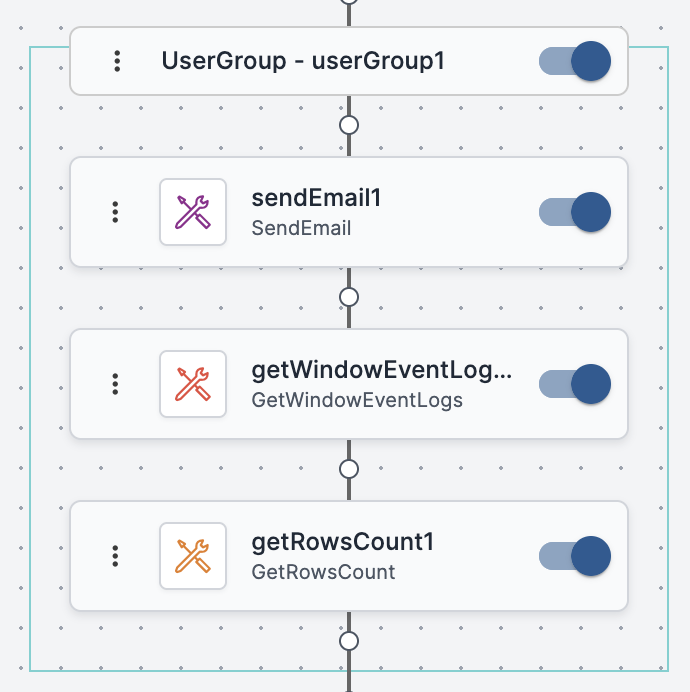

A group is a designated set of consecutive activities within a workflow. Groups are independent entities that have their own names and for which you can write notes and define error handling rules. Unlike a set of selected activities, where all performed actions affect every activity in the set, in a group you may perform either collective actions or actions on an individual activity within the group.

The Workflow Designer has several predefined group types, such as If/Else controls, Parallel controls, and While controls. You can also create your own groups using any relevant set of consecutive activities. It is recommended to divide your workflow into logical groups to enhance manageability.

Every group has a title bar from which you can perform operations on the group. The name of the group is displayed in the center of the title bar. User-defined groups are surrounded by a solid teal border.

To create a group:

1.  Enter Selection mode, and select all the activities that you want to include in the group. The activities must be in consecutive order within the workflow.
2.  In the upper left corner of the first activity in the set, click the hamburger menu and select **Group**.

The group is created.

### Performing Operations on a Group

The icons in the title bar of the group allow you to perform operations on the group. To perform these operations on an individual activity within the group, click the corresponding icon in the relevant activity.

|Icon| Description|
|---|---|
|  | Three-dot menu: opens a list of actions that can be performed on the group. |
|  | Toggling this icon disables/enables all activities in the group.|
|  | Toggling this icon hides/displays the activities in the group. |
|  | Opens the Group Details dialog, from which you can select error handling rules for the group and add notes about the group.|