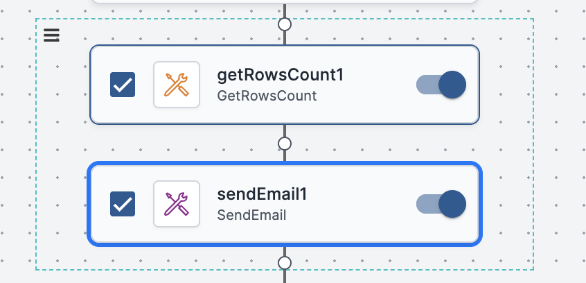

The Workflow Designer's Selection mode allows you to perform actions on multiple consecutive activities simultaneously. Working in Selection mode is useful when you need to disable, copy or delete a portion of your workflow.

To select activities:

1.  Click the three-dot menu in the upper left corner of the activity, and click **Select**.  
    The Workflow Designer enters Selection mode. The three-dot menu of all activities in the workflow are replaced by checkboxes. A dashed teal border appears around the selected activity, and its checkbox is teal and selected.  
    
2.  To select additional activities, check the boxes of the relevant activities.

### Performing Actions on Selected Activities

The hamburger menu  to the left of a selected activity contains a list of actions that you can perform on the activity.

:::note
When working in Selection mode, you may perform actions on selected activities only.
:::

When two or more consecutive activities are selected, a dashed teal border surrounds all the activities, and the activities share a common hamburger menu. Any action you perform affects all the activities in that set.