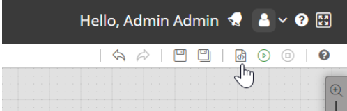
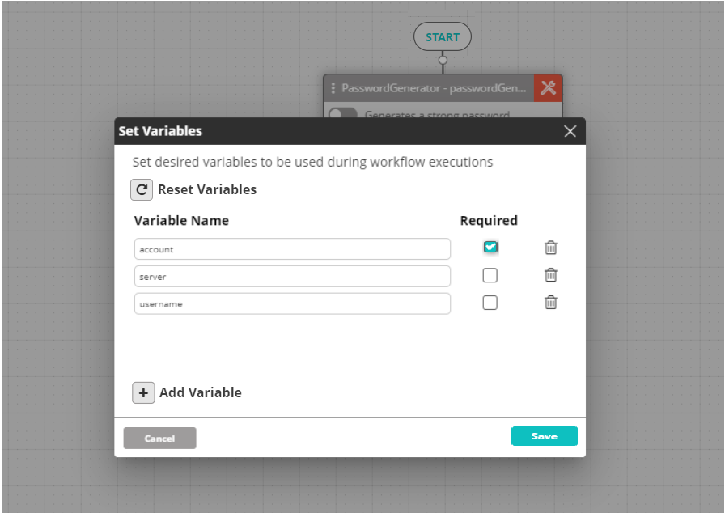

Once variables have been set (see [Settings Variables in Workflows](./set-variables-in-workflows.mdx)), the workflow editor can **Reset Variables** for that workflow by clicking on the **Set Variables** button in the workflow toolbar:

The existing setting will be displayed in the **Set Variables** window:

Here you can perform any of the available add/edit/delete actions (see [Setting Variables in Workflows](./set-variables-in-workflows.mdx)), as well as reset all variables currently in the settings by clicking on the **Reset Variables** button. Once you click on the **Reset Variables** button, a warning will be displayed. After confirming, the **Set Variables** window will be reset.