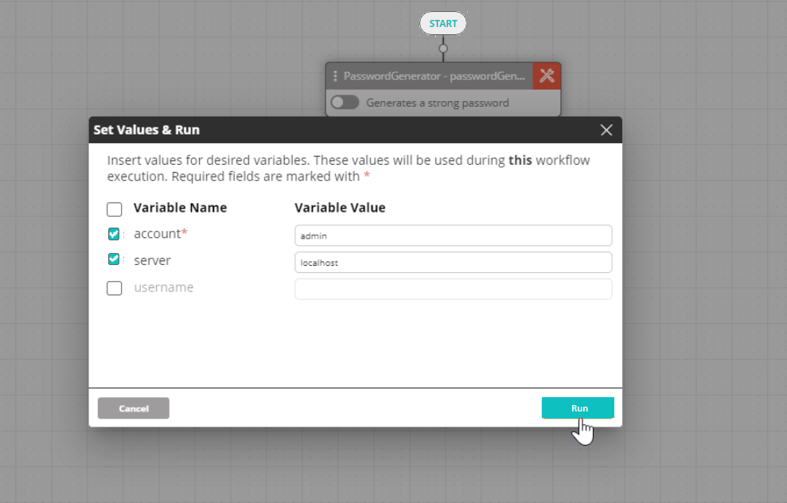
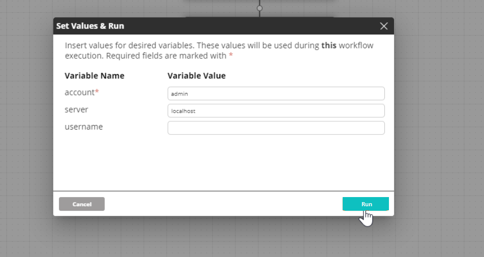

### Users with Editing Permissions

User can use the checkboxes on the left side to select which variables will be used during the workflow execution. Variables that have been set as required (marked with an asterisk) can be unchecked if desired.

Clicking **Run** executes the workflow using the selected variables with their inserted values.

### Users without Editing Permissions

User must insert values for the variables that have been set as required (marked with an asterisk). Variables that have not been set as required can be left empty.

Clicking **Run** executes the workflow using the variables with their inserted values.