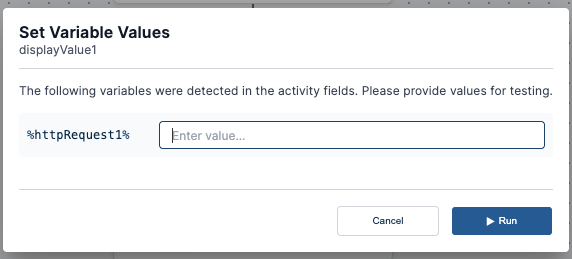

When creating a workflow, variables are entered into activities where input values are expected. Once the workflow is created, the [Test Activity](../Building-Your-Workflow/test-activities) function can set values for the variables in that workflow.

Variables will be automatically detected and added to the variable list that appears in the **Set Variables** window:

Once variables have been set, you can test the workflow with values for each of the variables, which will be automatically inserted into the appropriate activities when they run. 