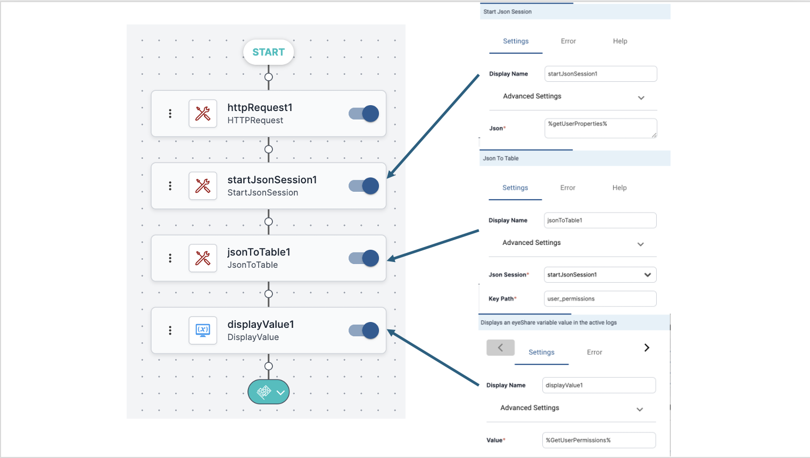

*Workflow variables* exist only within the scope of the current workflow. There are two types:
* Activity result variables
* User-defined variables

#### Activity Result Variables

These variables are automatically created for every activity added to a workflow. They activity's instance name becomes the variable name, which you can reference in any subsequent activity.

To reference an activity result variable, use:

`%activityInstanceName%`

Typing a `%` will trigger autocomplete, showing available workflow variables. You can also view them in the **Variables** pane under **Workflow Variables > Activity Results.**

Note: Workflow variables are local. They do not persist after execution and cannot be shared across simultaneous workflows.

You can reference variables across child and parent workflows with specific configurations. 

You use an activity result variable to reference the result of an activity execution from other activities.

:::note Case Study
Suppose you have an **HTTP Request** activity and rename it `getUserProperties` to reflect it making a REST call to get user information.

You then add:
- **Start JSON session** `startJsonSession1` to capture the JSON response.
- **JSON to Table** `getUserPermissions` to extract the `user_permissions` key.
- **DisplayValue** to print the result of `getUserPermissions`.

The image demonstrates passing the data through activity result variables.


:::

#### User-Defined Workflow Variables 

The *user-defined variable* is a workflow-local value created and assigned during execution. You can use them to:
* Construct data from other variables
* Append in-memory lists with activity results 
* Store the result of an activity to check multiple times in an If-else statement using a While loop
* Simulate event data as input

To create a user-defined variable, type its name, enclosing it in percentage signs, in a text field of an activity:
```
%userDefinedVariable%
```
User-defined variables appear in the **Variables** pane on the right, under **Workflow Variables > User-Defined Variables**.

During testing, user-defined variables can simulate event data. When used this way, the workflow will prompt you to assign values after starting. 

After testing the workflow, be sure to replace the user-defined variables with global variables or module variables that you have set up to provide actual input data from incoming events.
