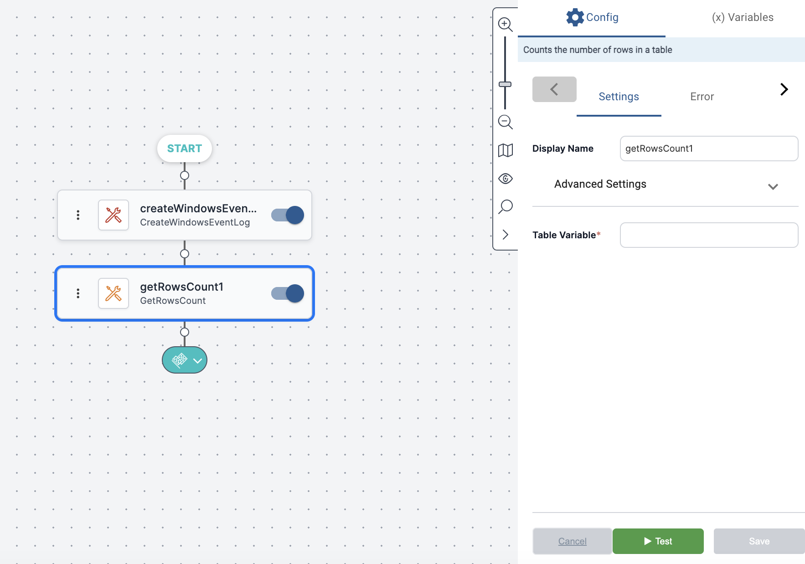
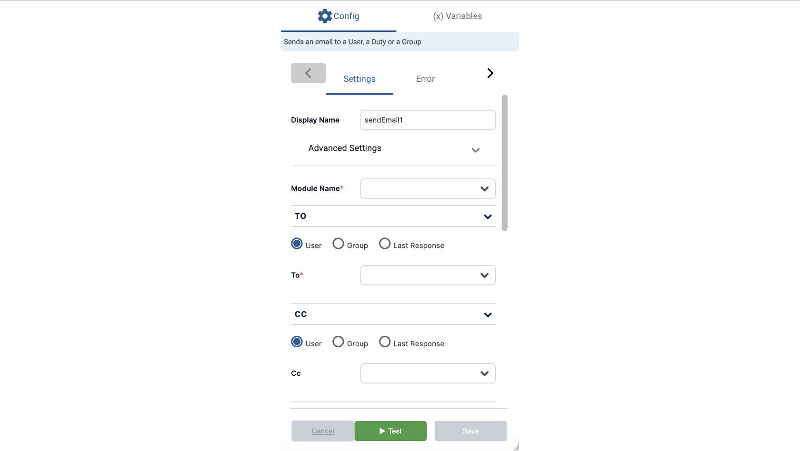

Activity settings define the values, parameters, or instructions that control how an activity runs. These settings vary by activity type. For example, the **Copy File** activity requires source and destination paths, while **Reset Password for Active Directory** needs a username, old password, and new password.

The example below shows an activity that retrieves the number of rows in a table. Its only setting specifies the table, which is output from the previous activity.

In contrast, the next example shows an activity (**Send Email**) that has multiple and more complex settings. These settings define the recipients of the email, the text of the email, attachments, and more.

It is recommended to always define implementation settings immediately after [adding an activity to the workflow](../Product-Navigation/Workflow-Designer/Add-Activities/adding-from-activities-tree.mdx). If settings are not defined, or not configured properly, your workflow will not run as expected. 