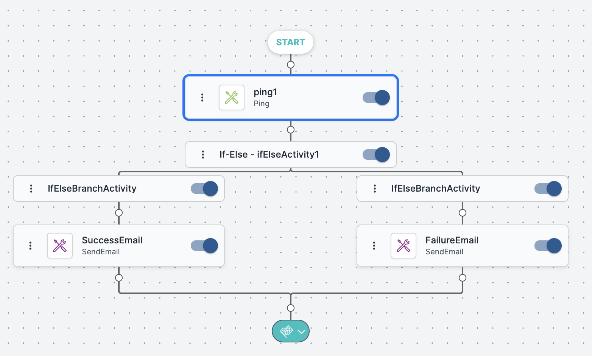

The following workflow—sending a status email after a ping check—illustrates a typical sequence of activities in the Workflow Designer. Each step is explained below the diagram.

The steps are as follows:

1. **Ping activity**—A ping command is executed to check the status of a server. The relevant IP address is defined in the activity settings.
2. **If/Else control**—At this point, the workflow proceeds in one of two directions, depending on whether the ping command returns _Success_ or _Failure_.
3. **Send Email activity**—An email is sent to inform one or more administrative users about the server status. The body of the email varies according to which workflow branch is running:
   * **Success:** Server is up.
   * **Failure:** Server is down.