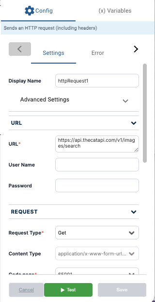
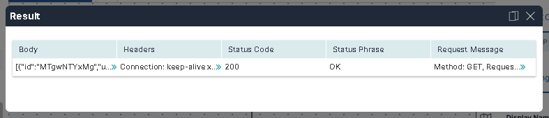

Once activity settings that define the values and parameters of the activity have been added, you can test the validity of the activity in the right panel. 

The **Test** button tests the activity independently, without running the other activities in the workflow.

:::note
Make sure the activity is saved before using the **Test** feature so you are using the most recent changes.
:::

### Execution Log

When you run a test, an **Activity Test Result** log appears at the bottom of the activity. The log displays a single-line response in two columns: *Status* and *Result.*

You can expand the results into a modal view if the arrow icons are visible.

