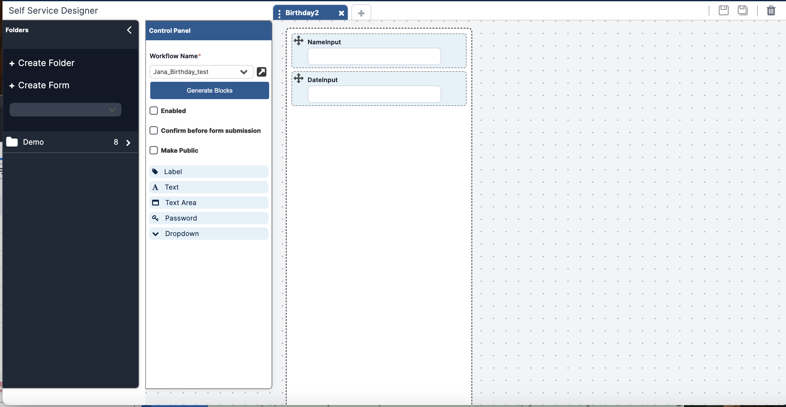

To create the form associated with your Workflow:

1. Open the hamburger menu at the top left and click **Builder > Self Service Designer**.
2. Click **+ Create Form** in the lefthand menu.
3. Enter:
   1. **Name**: a unique name
   2. **Folder**: select an existing folder or click **Add Folder** to create a new one.
   3. **Description**: (optional) details about the form.
   4. **Tags**: (optional) any tags needed

### Generate Fields

1. In the **Control Panel**, select the **Workflow Name** you just created.
2. Click **Generate Blocks**.

Your form should automatically populate two fields:
- NameInput
- DateInput

3. Click **Enabled**. 
4. Click the **Save Icon** in the top right.

