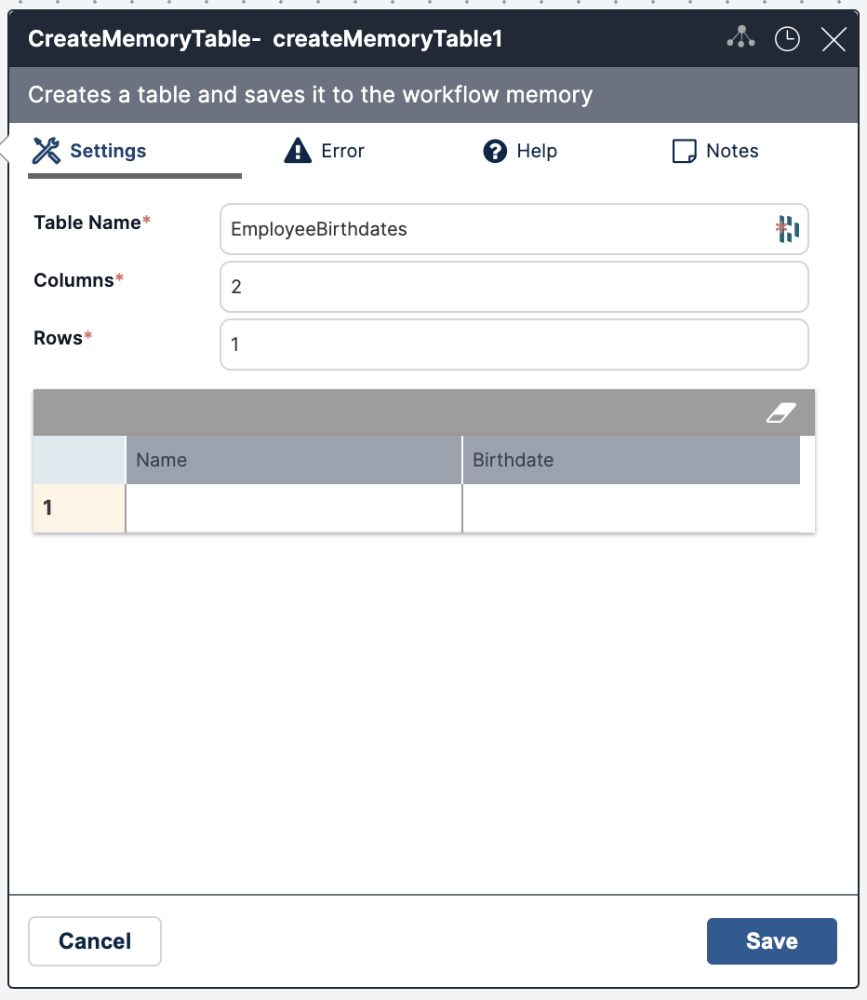
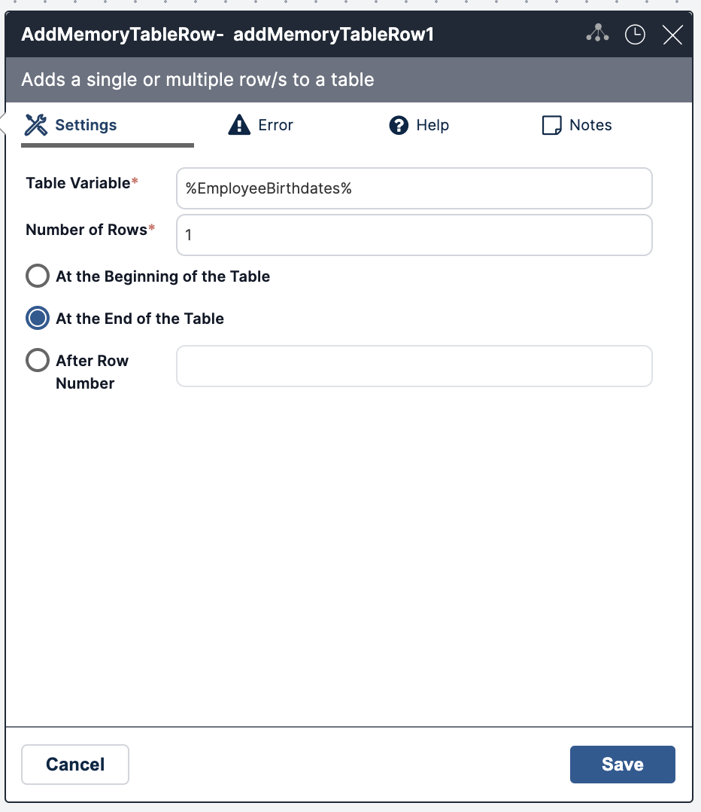
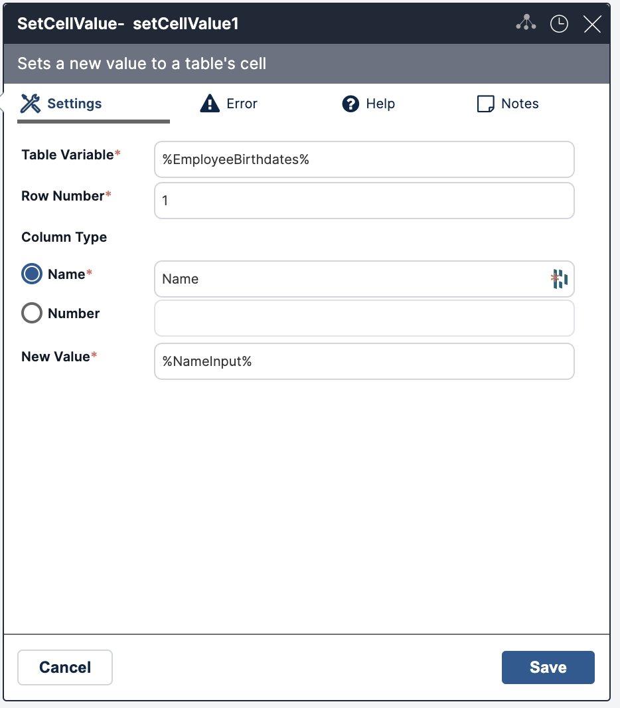
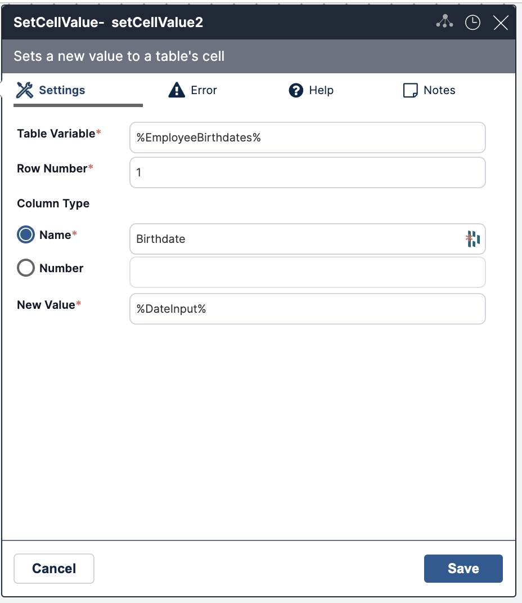
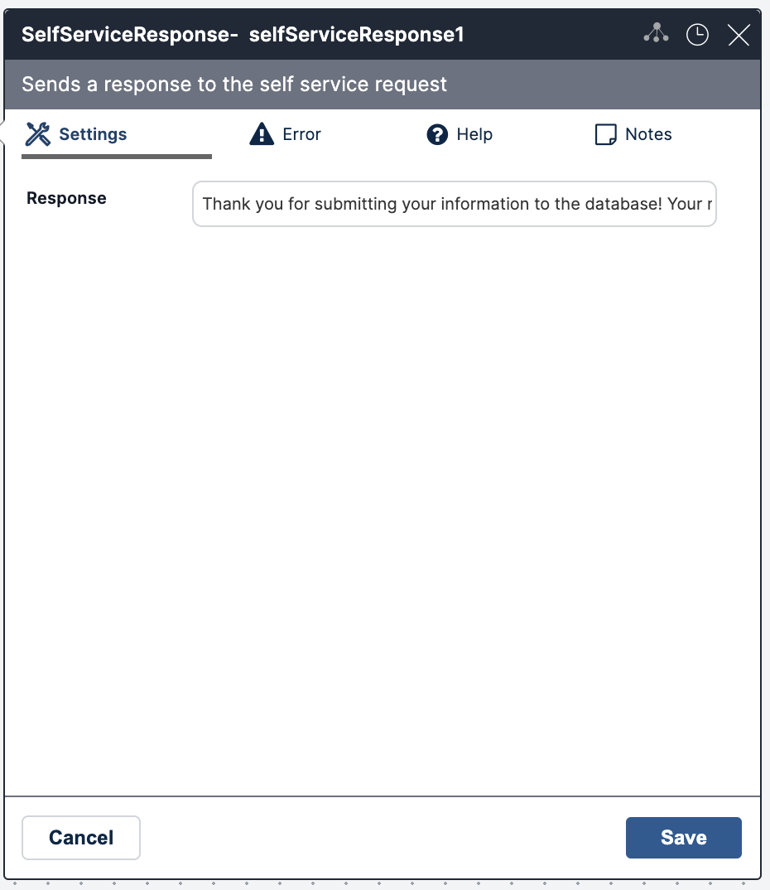

### Open a New Workflow

1. Navigate to the top hamburger menu.
2. Click Builder > Workflow Designer.
3. Click the + at the top of the design area.

For more on creating a new workflow, see [Workflow Navigation](../Product-Navigation/Workflow-Designer/workflow-navigation.mdx)

### Add Activities

For this workflow, we will add a memory table, an activity that adds a row to the memory table, and two activities to update values in the cells. The final activity will be the self service response. 

#### Create a Memory Table

1. Add the **CreateMemoryTable** activity under the *Start* icon.
2. Enter:
   1. **Table Name**: EmployeeBirthdates
   2. **Columns**: 2
   3. **Rows**: 1
   4. In the table, name the first column **Name** and the second column **Birthdate**.

#### Add Memory Table Row

1. Add the **AddMemoryTableRow** activity under the **CreateMemoryTable** activity.
2. Enter:
   1. The **Table Variable** name from our **CreateMemoryTable** activity.
   2. **Number of Rows**: 1.
   3. Select **At the End of the Table**.

#### Add Set Cell Value
1. Add the **SetCellValue** activity.
2. Enter:
   1. The **Table Variable** name from our **CreateMemoryTable** activity.
   2. **Row Number**: 1.
   3. **Column Type**: Select **Name** and write *Name* in the field. *Name* is the title we gave column 1 in our **CreateMemoryTable** activity.
   4. **New Value**: enter a variable to be used in our form. (e.g. *%NameInput%*)

#### Add Set Cell Value
1. Add another **SetCellValue** activity.
2. Enter: 
   1. The **Table Variable** name from our **CreateMemoryTable** activity.
   2. **Row Number**: 1. 
   3. **Column Type**: Select **Name** and write *Date* in the field. *Date* is the title we gave column 2 in our **CreateMemoryTable** activity.
   4. **New Value**: enter a variable to be used in our form. (e.g. *%DateInput%*).

#### Add Self-Service Response Activity
1. Add **SelfServiceResponse** activity.
2. Enter:
   1. **Response**: Thank you for submitting your information to the database! Your name, %NameInput%, and birthdate, %DateInput%, have been recorded!

#### Save 
Save your workflow and continue to create your form.