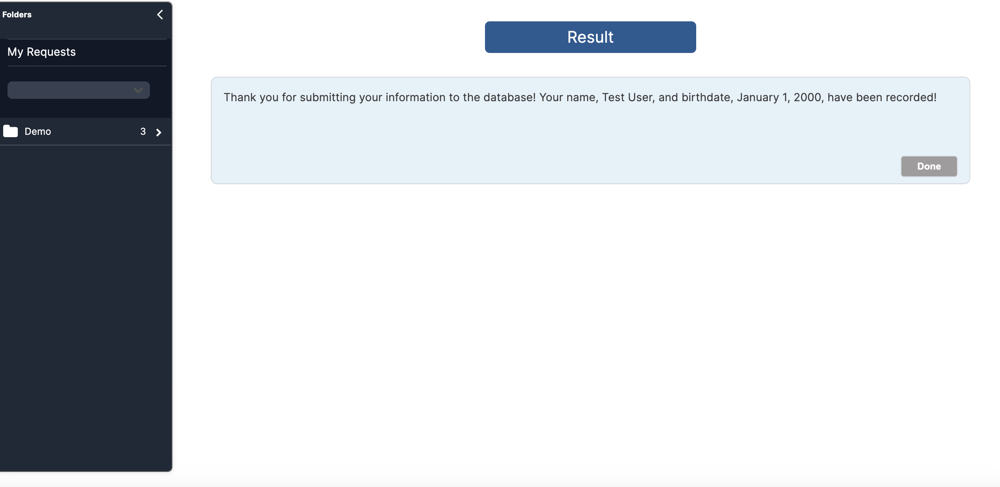

With the workflow and form in place:
1. Navigate to the hamburger menu in the top left.
2. Click **Self Service Portal.**
3. In the lefthand menu, navigate to the folder containing your form and click the form name.
4. Add your *name* and a *date*.
5. Click **Submit**.

You should return a result confirming the success of your first form.

