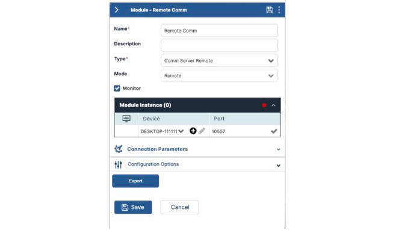
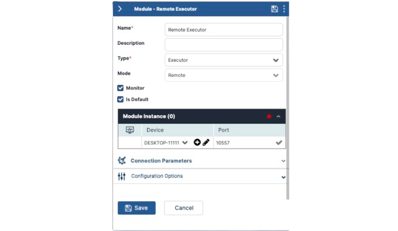
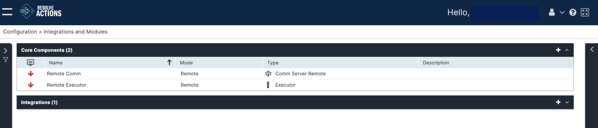

After running the VAR::PRODUCT_FULL Remote Executor Installer, configure the setup by logging in to your tenant and navigating to **Main Menu > Configuration > Integrations and Modules**. 

### Configure the Remote Comm Module

In the **Core Components** bar, click the plus **(+)** sign to create a new module and complete the following fields:
1. **Name**: enter *Remote Comm*.
2. **Description**: Add a description.
3. **Type**: Select *Comm Server Remote*.
4. **Mode**: Select *Remote*.
5. Under **Module Instance**:
    - Select your device under **Device**.
    - Save the **Port** as it appears.
6. Click **Save**.

### Configure the Remote Executor Module

In the **Core Components** bar, click the plus **(+)** sign to create a new module and complete the following fields:
1. **Name**: Enter *Remote Executor*.
2. **Description**: Add a brief description.
3. **Type**: Select *Executor*.
4. **Mode**: Select *Remote*.
5. Check the box next to **Monitor**.
6. Check the box next to **Is Default**. 
7. Under **Module Instance**:
    - Select your device under **Device**
    - Save the **Port** as it appears.
8. Click **Save**.

:::note

Selecting the **Is Default** option in the *Remote Executor Module* selects the Remote Executor option automatically for all Activities that run on the Remote Executor.

:::

You will see the **Remote Comm** and **Remote Executor** modules running on-premises, with their statuses displayed on this screen.

The modules may take a few minutes to display as **Up**, indicated by a green arrow.

:::caution
Do not take further action with these modules or the device assignments otherwise the modules might lose connection or disrupt the service.
:::

