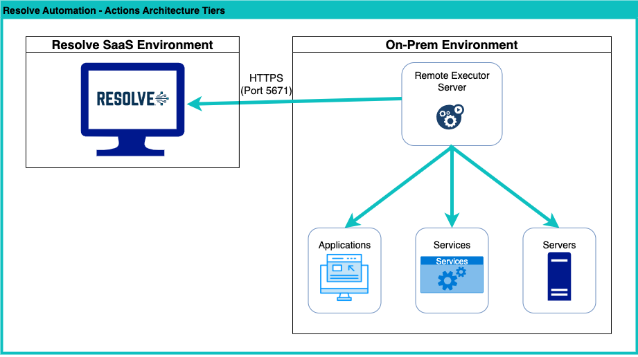

Before you can start building workflows for automating IT infrastructure in your local network, you need to install several on-premises components that allow for communication between your VAR::PRODUCT_FULL cloud tenant and your on-premises environment. These components are delivered by the Actions Remote Installer.

## Configurations 

VAR::PRODUCT_FULL is able to support **multiple remote executors** in a variety of configurations.

|Type   |Definition|
|------ |--------   |
|Basic| A single Remote Executor on a single remote server. This is the simplest scenario and will account for most use cases.|
|Multi-Purpose|Multiple Remote Executors from multiple Modules on a single remote server. This scenario allows a single server to handle execution for multiple Modules, where Executors could easily be other Modules like Service Now or Jira.|
|Distributed Processing|A single Remote Executor from a single Module running on multiple remote servers. This scenario allows distribution of heavy volumes of work or increases resiliency and availability.|
|Isolated| A single Remote Executor from multiple Modules running across multiple, isolated remote servers. Similar to the Basic scenario but provides single responsibility Modules.|

You can skip this section if your automation needs only include IT infrastructure located in the cloud.

## Actions Architecture

In the Actions architecture, your on-premise environment connects to the Resolve Actions environment over HTTPS. The Remote Executor then communicates with Resolve through a message queue on port 5671.

