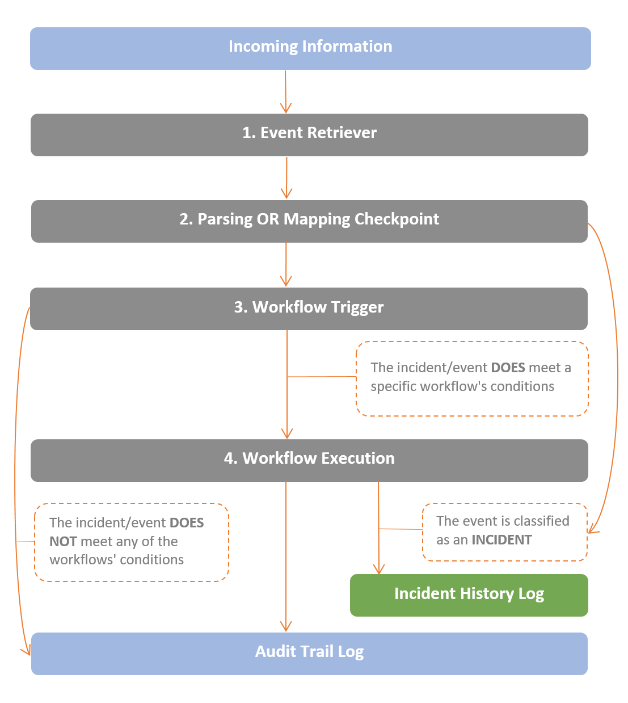

VAR::PRODUCT_FULL functions as an informational pipeline of events.

Every event (an incoming email, a syslog message, an SNMP Alarm, etc.) is retrieved by the **Event Retriever** and then arrives at the **Parsing/Mapping Checkpoint**, as the figure below shows.

Traditionally, events that originate from an integrated module (for example: ServiceNow, McAfee, BMC Remedy etc.) are mapped, and events which originate from the built-in components are parsed, but it is also possible to parse events from the integrated modules. Whatever the case, by the end of the parsing/mapping process the event may be classified as an **Incident**. An incident is an event with several additional characteristics:

- Incidents provide Resolve Actions their originating device, their duration and their classification. This information may be broken down and used in reports, in conditions and within running workflows.
- Incidents have a current state - **up/down**. Workflows may be invoked upon a change of state.
- Incidents are counted and registered to the Incident History Log.

After the parsing/mapping checkpoint, events are checked by the **[Workflow Trigger](../../Product-Navigation/Repository/Schedules-and-Triggers/Triggers)**. If certain conditions apply, the event (basic or incident) will invoke a procedural workflow at the **Workflow Execution Point**. Regardless of whether a workflow is invoked, each event (basic or incident) is registered to the **[Audit Trail Log](../../Product-Navigation/Insight/Audit-Trail/viewing-the-audit-trail-log.mdx)**. Events classified as Incidents are also registered to the **[Incident History Log](../../Product-Navigation/Insight/Incidents-History/viewing-the-incident-history.mdx)**.

The pipeline uses four handlers:

1. The **Event Retriever** - retrieves information from the pipeline.
2. The **Parsing/Mapping Checkpoint** - classifies the event as an incident or a basic event.
3. The **Workflow Trigger** - decides whether or not to invoke a workflow.
4. The **Workflow Execution Point** - executes the workflow.

In subsequent chapters in this User Guide, you will be shown where you are in the pipeline with a diagram like this:

