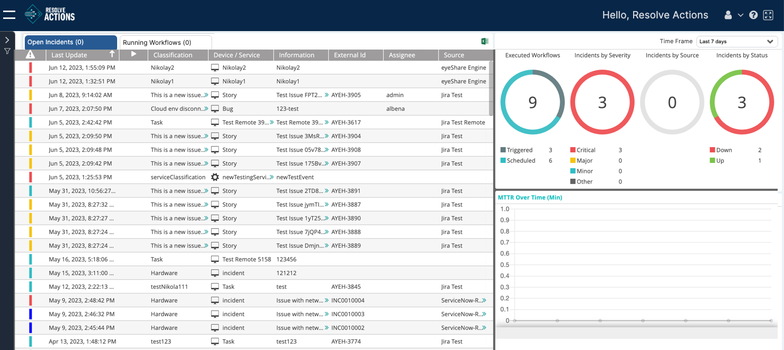

VAR::PRODUCT_FULL is an intelligent IT Automation and Orchestration platform built for the digital era. Powered by machine learning algorithms, it acts as a force multiplier, driving efficiency through a simple and powerful Web 3.0 automation platform for IT and security operations. Resolve Actions helps enterprises save time on manual and repetitive tasks, accelerate mean time to resolution and maintain greater control over IT infrastructure. As an agent-less platform, it is easily deployed, allowing you to rapidly automate tasks and processes, including inter-operations across disparate solutions and systems, all in one, unified platform.

### Additional links

- [Understanding the Data Flow](./Understanding-the-Data-Flow.mdx)
- [From Event to Incident](./From-Event-to-Incident/Background.mdx)
