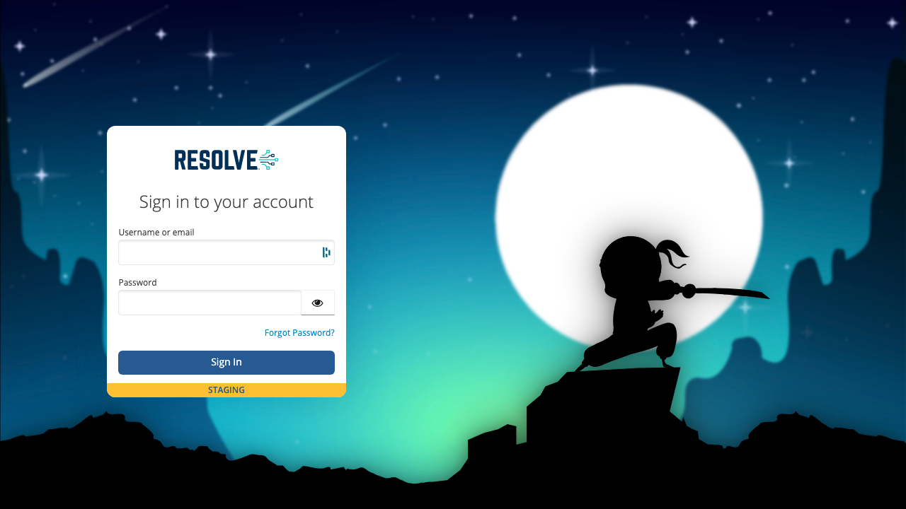

To log in to VAR::PRODUCT_FULL, you need user credentials and a login URL that will be provided by your Resolve representative. We recommend bookmarking the URL in your browser.

VAR::PRODUCT can be run only in Google Chrome.

:::note
To use VAR::PRODUCT, you need display resolution of 1280x720 (HD) or higher.
:::

## Login Steps

To complete the login process:

1. In the Chrome browser, enter the login URL.
2. Enter your login credentials.  
   

The dashboard appears. On first login on a new system, it doesn't visualize any data.

If you log in to a system that has been used for a while, the Dashboard visualizes various aspects of your work:

The dashboard elements are explained in detail in [Home Page](../Product-Navigation/Home-Page).
