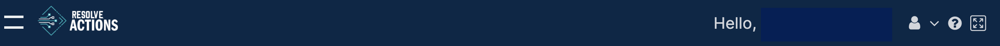
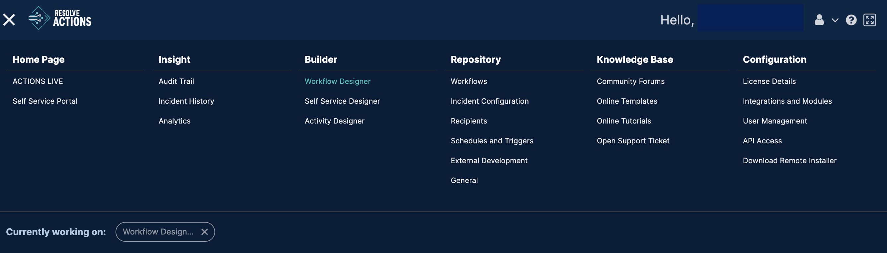
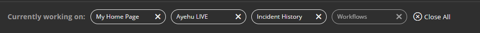

Open the navigation menu by clicking the left-hand down arrow on the VAR::PRODUCT_FULL title bar:

This in turn drops down the navigation menu:

:::note
The title bar is common to all Resolve top level displays making the navigation menu available from any where in the system.
:::

The navigation menu shows a topic choice-list for each section of the system and along the bottom, a history bar of visited topics, for example:

At any point, you can close any or all the topics in the list or re-visit a topic by clicking inside its topic bubble.