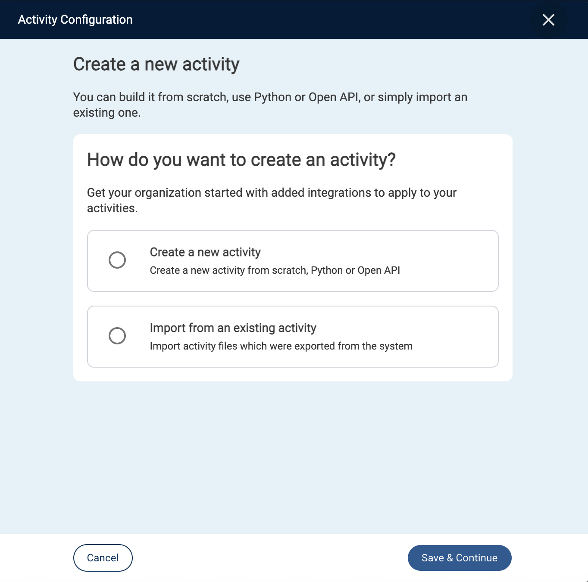

To create or add a new activity, click **+ New Activity** in the lefthand menu.

This will open the *Activity Configuration* popup, which will prompt you to either:
- Create a new activity
- Import from an existing activity

### Create a New Activity
The *Create a new activity* option includes options to:  
- create an activity from scratch,
- Python
- Open API.

### Import an Activity
The *Import an existing activity* includes the option to upload a previously exporting activity or an activity from the Exchange.