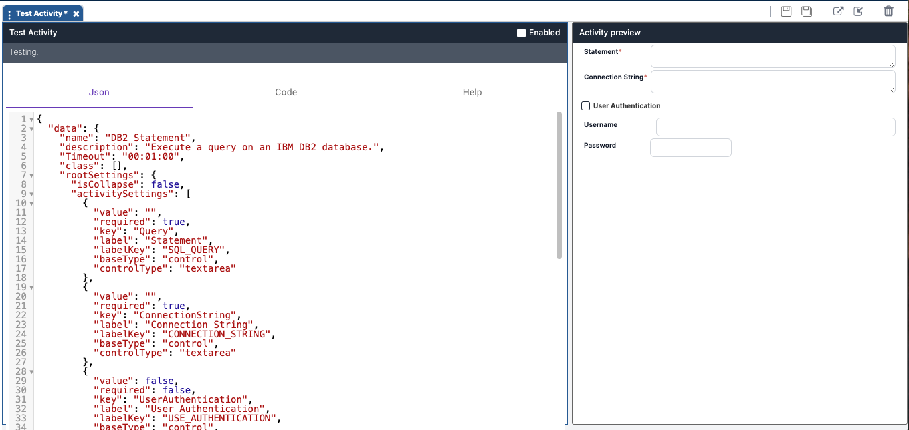

Once you click **Create** or **Import** to create the new activity, the Activity Designer canvas will display.

## Displaying Imported Activities

When importing an activity, the code and JSON of the imported activity will display. The code and JSON can be edited as desired.

Imported activities are disabled by default and the **Enabled** checkbox is unchecked. Disabled activities will not show in the Workflow Designer. To see activities in the Workflow Designer Toolbox, check the **Enabled** checkbox.

## Displaying New Activities

New activities will automatically open with a default JSON template. In the split screen, you can view a real-time preview of your JSON. The preview screen updates dynamically and alerts you to any errors in the JSON code. 

In the header section, you will see the activity's **name** and **description** as you entered them during the creation process. There is also a checkbox to **enable** your activity. If the box is checked, the activity is enabled and will be available in the Toolbox of the Workflow Designer for use in workflows. If the box is unchecked, the activity is not enabled and thus won’t be visible in the Workflow Designer Toolbox for use.

The code section of the design canvas shows three tabs.

* The **Json** tab shows the JSON code of the activity which will be translated to its GUI. Here, you can write any valid JSON you want to make the activity look as desired. Upon initial opening, the **Json** tab of the coding section will display a template for an activity (the Display Value activity) as an example to use when creating your custom activity. This default template shows you the syntax that needs to be used and some possible parameters for fields.
* The **Code** tab shows the code for the activity. Upon initial opening, the Code tab of the coding section will display a template to use for coding activities. This includes the required assemblies that must be part of the activity package.  
  Here, you can choose your coding language – C#, VB.NET, or Python – and then add any specific assemblies needed to execute your activity. Write your code within the defined parameters of the template, and your custom activity will execute as coded.
* In the **Help** tab, enter a description of the activity and its settings.

#### Guides
To walk through guided examples of building the frontend of your own activities with JSON, visit our Guides:
- [Backend Code in the Activity Designer](../../Building-Your-Workflow/Guides/activity-designer-back-end-code.mdx)
- [Frontend Code in the Activity Designer](../../Building-Your-Workflow/Guides/activity-designer-front-end-code.mdx)
 
 