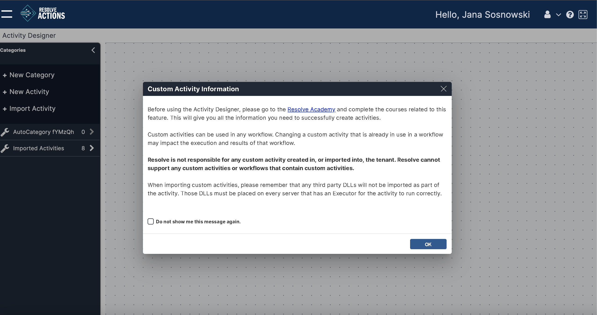
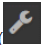

The **Custom Activity Information** popup will automatically appear if this is your first time entering the Activity Designer or if no activities are already open. 

Once you close this window, you can create and/or import custom activities.

## Create New

Click **+New Activity** on the right menu to open the **Create New** window.

On this screen, enter: 

* **Name**: The name of the Activity. This name will be visible in the Activity when viewed in the Workflow Designer canvas.
  *   Name must be unique to all other activities in the system.
  *   Activities can contain only alphabetical characters.
  *   There is a limit of fifty (50) characters, including spaces. 
  :::caution
  It is possible to change the Activity display name after the Activity is created. However, the Activity's internal name and internal value will not be updated even when the display name is changed.
  :::
* **Run via:** Select either _Executor_ or _Custom Integration_.
* **Category**: The custom category under which this Activity will appear. Category names must be unique.
  * Custom activities can only be created under custom categories, not existing standard categories.
  * Only one category level is allowed at this time; no subcategories.
  * All custom categories share the same wrench icon:  
    
  * To add a new category, click the **Add Category** button to the right of the **Category** field. Enter a new category name in the window and click **Add**.
  * It is recommended that category names be short so they are visible in the Activity Designer and the Workflow Designer.
  * Category names must be unique.
  * Click the **\+ New Category** link in the Activity Designer canvas to create new categories.
* **Description**: The description of the Activity. This will be visible in the Activity settings in the Workflow Designer canvas.
  *   It is recommended that the Activity description be short and concise so that it is easy to read when viewing the Activity in the Workflow Designer Canvas.

Once all fields have been filled in, click **Create** to create the new Activity.