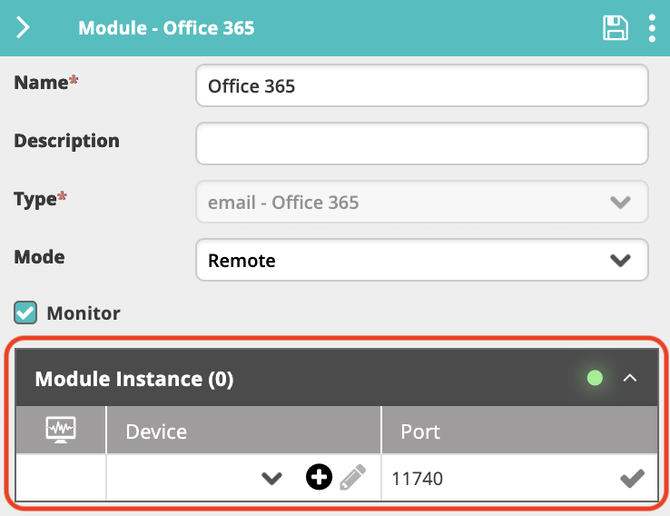

The Email - Office 365 module provides a bidirectional communication channel (sending and reading emails) between an Office 365 mailbox and VAR::PRODUCT_FULL by using a Web Services API. After you add and configure the module, VAR::PRODUCT pulls new emails, translate them into incidents, and displays them in the VAR::PRODUCT LIVE Dashboard.

## Prerequisites

The following provisions must be made before configuring the module.

### Authentication

VAR::PRODUCT supports OAuth authentication for Office 365. It requires:
* [Creating an application within an Azure instance](#setting-up-azure) with the following minimum rights for the sign-in user account: read, write, send.
* A User name, Password, Application Client ID, and Application Tenant ID for the sign-in user account.

[Caution below for periodic review.]: #

:::caution
In case you're still using basic authentication (username and password) for some of your tenants, we recommend transitioning to OAuth as soon as possible, as basic authentication for Office 365 has been deprecated since October 2022.
:::

:::note
Currently, multi-factor authentication (MFA) is not supported for VAR::PRODUCT.
:::

### Connectivity

Office 365 is a SaaS solution. The Email - Office 365 module requires Internet access on any VAR::PRODUCT server running an instance of it.

See a [list of Office 365 URLs and IP address ranges](https://learn.microsoft.com/en-gb/microsoft-365/enterprise/urls-and-ip-address-ranges?view=o365-worldwide&redirectSourcePath=%252fen-us%252farticle%252fOffice-365-URLs-and-IP-address-ranges-8548a211-3fe7-47cb-abb1-355ea5aa88a2) provided by Microsoft, in case you need to configure them in your firewall.

Initially, the module will attempt to access port `443` (HTTPS). If unsuccessful, it will try port `80` (HTTP).

:::note
Make sure that the mailbox license is set to Office 365 E1, as other license types don't support connections from external applications.
:::

## Setting Up Azure

Before you start using the Email - Office 365 module, you need to register a client application and an application (client) ID in Azure. To do that, take the following steps:

1. In the [Azure portal](https://portal.azure.com), log in with the Azure administrator account.
2. Click **All services**.
3. In the search box, search for “App registrations”. 
4. Click **New registration**.
5. In the **Name** field, give the application an indicative name.
6. Click **Register**.
7. In the panel on the left, click **Authentication**.
8. Under **Advanced settings > Treat application as public client**, select **Yes**.
9. In the panel on the left, click **API permissions**.
10. Click **Add a permission**.
11. Select **Microsoft Graph**.
12. Select **Application permissions**.
13. Add required permissions to the app (minimum requirements):
    * Mail.Send
    * Mail.ReadWrite
14. Click **Add permissions**.
15. Click **Grant admin consent**.
16. Again in the navigation on the left, click **Certificates & secrets** and then **New client secret**.
    * Type in a **Description**.
    * In **Expires**, specify when you want the secret to expire.
17. Click **Add** to generate the new client secret and then immediately take note of the **Value** that will be used in the [**Connection Parameters**](#creating-the-module-instance) section of the module instance configuration described below.
    :::caution
    This is the only time this value will be shown in clear text. If you fail to take note of it, you will have to generate a new client secret.
    :::
18. On the application's **Overview** page, take note of the **Application (client) ID** and **Directory (tenant) ID** that will be used in step 10 of the [**Connection Parameters**](#creating-the-module-instance) section of the module instance configuration described below.

## Creating the Module Instance

You need to configure a module instance for each Office 365 mailbox that you want to integrate with.

1. Go to **Main Menu > Configuration > Integrations and Modules**.
2. From the top right corner of **Integrations**, click **+**.  
   The module properties screen appears.
3. In the **Name** field, enter a name for the new module instance.  
   It is a good practice to provide a descriptive name to let you distinguish between multiple module instances of the same type.
4. (optional) In the **Description** field, enter a description for the module instance.
5. From the **Type** field, select **email - Office 365**.
6. In **Mode**, select where you want the module instance to run:
    * **Cloud**—The module instance will run in your cloud instance of VAR::PRODUCT. This option is suitable for integration with services that run in the cloud or on-premises services that are accessible from the cloud.
    * **Remote**—The module instance will run on the server where you installed the remote executor (installing a remote executor is needed when the server does not have access to the SQL DB). This option is suitable for integration with services that run in a separate network and are normally not accessible from the main network where VAR::PRODUCT runs.
7. Check **Monitor** if you want VAR::PRODUCT to monitor the module instance.  
   By selecting this option, a new incident is created when the instance is down.
8. (**Mode: Remote** only) When you have one or more email - Office 365 Integration installed on remote machines, you can select to which remote email - Office 365 module you want to connect. Select the device where the module instance is installed from **Module Instance > Device**, as well as the **Port** through which it will communicate.
   
    * If you haven't predefined a [Device](../../../../Product-Navigation/Repository/Incident-Configuration/Devices.mdx#adding-devices) within **Incident Configuration**, you can click the plus icon to add a new Device directly from this screen. Enter a **Name** and an **IP Address** within the configuration, where the **Name** must be resolvable within DNS (FQDN) or IP Address.
9. Click **Save** to create the module.
10. In the **Connection Parameters** section, specify the Email - Office 365 server connection details:
    1. For **Auth Type**, select the OAuth type you will be using (**OAuth** or **OAuth2**).
        * For **OAuth**:
            1. Under **Account information > Name** field, enter the name or the email address for the Office 365 user account.
            2. Under **Logon information**:
                * For **User name**, enter the name or the email address for the Office 365 user account.
                * For **Password**, enter the password for the Office 365 user account.
                * For **Application ClientID**, enter the Application (client) ID assigned in the [application client registration in Azure](#setting-up-azure).
        * For **OAuth2**:
            1. Under **Account information > Email Address** field, enter the email address for the Office 365 user account.
            2. Under **Logon information**:
               * For **Secret Key**, enter the secret key from the [application client registration in Azure](#setting-up-azure).
               * For **Application ClientID**, enter the Application (client) ID assigned in the [application client registration in Azure](#setting-up-azure).
               * For **Application TenantID**, enter the Tenant ID from the [application client registration in Azure](#setting-up-azure).
    2. Click **Test Connection** to verify your connection with the server.  
       A valid connection is indicated with a green tick icon.
11. Click **Save** again to complete this section of the configuration.
12. In the **Configuration Options** section, specify additional generic module instance options:
    * **Log Level**—Select how verbose you want the module-related log messages to be. Level 1 is the least verbose.
      The log file is located in the module's installation folder (`C:\Program Files\Resolve\Actions Express Email` by default).
13. Click **Save**.

## Related Activities

To use the VAR::PRODUCT Email activities, open the **Workflow Designer** in the Main Menu **Builder** section. Search, browse, or click the **+** in the canvas area to find the desired activity and add it to the workflow.

Currently, one Email activity is available:
* [Send Email Activity](../../../../Activity-Repository/Communication/send-email.mdx)
