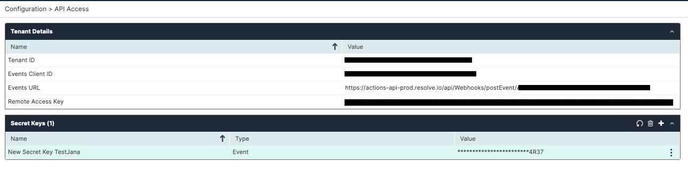
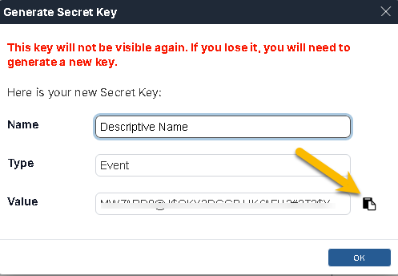
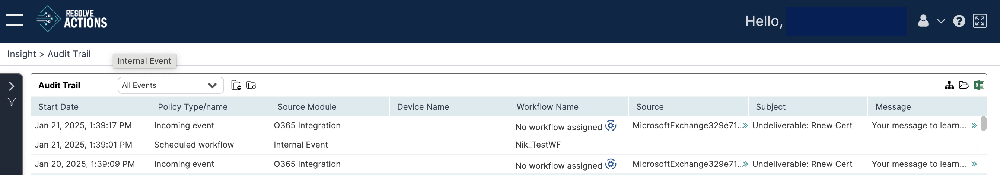
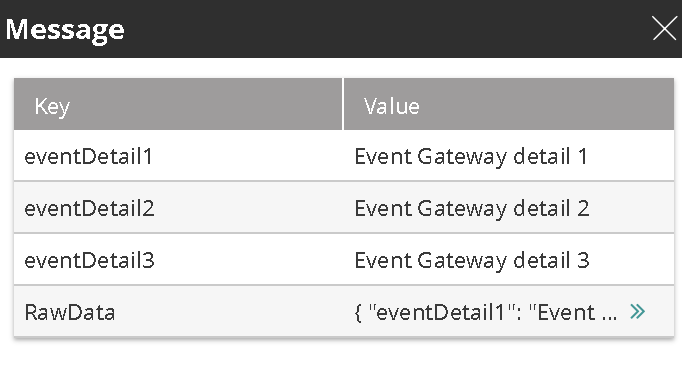

The Event Gateway provides a RESTful API to receive events from external sources. It automatically parses the request body and maps the received data to VAR::PRODUCT variables for use in workflow design.

The Event Gateway is preconfigured on your VAR::PRODUCT instance and ready to receive events.

## Authentication

All Event Gateway endpoints require the following:

- Tenant ID 
- Events Client ID
- Secret Key


### Acquiring the Tenant ID and Events Client ID

To obtain these IDs: 

1. Open the hamburger menu in the top navigation and go to **Configuration > API Access > Tenant Details**.
2. Click the **Tenant ID** line to open the right module.
3. Use the *Copy* icon to copy the Tenant ID and the Events Client ID.

   

### Acquiring the Secret Key

The Secret Key is used as the password. To obtain the Secret Key, follow these steps:

1. In the **Secret Keys** section, click the **plus sign** at the top right of the list.  
   The **Secret Keys – New Secret Key** sidebar appears.
      Enter the following information: 
   * **Name**, enter a name that will help you identify the key.
   * **Type**: select **Event**
2. Click **Save**.
3. From the **Generate Secret Key** dialog box that appears, copy and take note of the **Value** field.
 
:::note Caution
   The value is only presented once. If you fail to copy it, you will have to [regenerate the key](../../../../Getting-Started/Setting-Up-Hybrid-Components/generating-secret-keys.mdx).
:::
4. Click **OK** to close the Generate Secret Key window. 
5. To complete the process, click **Save** near the bottom of the sidebar. 


### Acquiring the Event URL

The Event URL can be acquired from the Support Team or from the Configuration menu. To obtain the Event URL:

1. From the top navigation bar, open the **hamburger menu** under the Configuration section and select **API Access**. 
2. Under the **Tenant Details** section, find the **eventClientUrl** entry.
3. Copy the the value.


## Sending an Event to the Event Gateway

Use an authenticated POST request to send events to VAR::PRODUCT.

##### HTTP Method

POST

##### Request URL

Send requests to the following URL:

`https://actions-api-prod.resolve.io/api/Webhooks/postEvent/<Tenant ID>`

Where:
* `<Tenant ID>` is the [value of **Tenant ID**].

##### Request Authentication

Basic authentication is required. See [Headers](#request-headers).

##### Request Headers

The following request headers are required:

* `Content-Type`—Indicates the media type of the body. Supported values: 
    * `application/json`
    * `application/xml`
    * `text/plain`
* `Authorization`—`Basic` authentication is required. See [Authentication](#authentication) to learn how to set up a username and a password.

##### Body Format

Requests can be sent in the following formats:
* XML (text/xml)
* JSON
* String

##### Response

The Event Gateway replies with one of the status codes listed below.

| Status Code | Message      | Description                                                                       |
|-------------|--------------|-----------------------------------------------------------------------------------|
| 200         | Success      | Message was sent successfully.                                                    |
| 401         | Unauthorized | Indicates an issue with the credentials |
| 403         | Forbidden    | The source IP is not included in the [allowed IP range](#acquiring-the-secret-key).     |

##### Examples

In the following example, we pass three custom parameters (`eventDetail1`, `eventDetail2`, `eventDetail3`).

import Tabs from '@theme/Tabs';
import TabItem from '@theme/TabItem';

<Tabs>
<TabItem value="xml" label="XML">

```xml
<?xml version="1.0" encoding="UTF-8"?>
<root>
    <eventDetail1>Event Gateway detail 1</eventDetail1>
    <eventDetail2>Event Gateway detail 1</eventDetail2>
    <eventDetail3>Event Gateway detail 1</eventDetail3>
</root>
```

</TabItem>
<TabItem value="json" label="JSON">

```json
{
    "eventDetail1": "Event Gateway detail 1",
    "eventDetail2": "Event Gateway detail 1",
    "eventDetail3": "Event Gateway detail 1"
}
```

</TabItem>
</Tabs>

The returned response is `OK` (status code 200 - Success).

## Viewing Incoming Requests

Incoming requests can be viewed from the Main Menu under **Insight > Audit Trail**.



To see details about a specific event, click in its row in the **Audit Trail**. The details will be displayed in the **Activity Log** panel below.

To see details about a returned message, click the green arrows in the desired row of the **Message** column. This is an example of how they will look:



Each request parameter is displayed as a row in the **Key** column. It is automatically mapped as a variable that you can use to access the parameter's value in workflows—for example: `%eventDetail1%`, `%eventDetail2%`, `%eventDetail3%`.

Each event includes the following details:
* The parameters sent. In our example, this is `%eventDetail1%`, `%eventDetail2%`, `%eventDetail3%`.
* `RawData`: The raw request body.

:::note
Using `%body%` as a variable in a workflow will return the entire row data.
:::

## Automating an Incoming Event

Sending a request to the Event Gateway generates an event in VAR::PRODUCT, visible in the [Audit Trail](../../../Insight/Audit-Trail/viewing-the-audit-trail-log.mdx). To automate the event, you need to create a trigger for a workflow.

Triggers for the Event Gateway work by matching a global variable with the data received in the event. If you want to react to multiple values of the same parameter, repeat the following procedure for each of them, creating separate global variables.

Take these steps to automate the event coming in from the Event gateway:

1. Create a [global variable](../../../Repository/General/Variables.mdx) that matches the data that you expect to receive from the external source:
   * For **Name**, enter the exact name of a parameter received as part of the incoming request's body.  
     Matching a single body parameter is enough to trigger an automation.
   * For **Mode**, select **Set Variable's Value on Every Incident Update**.
   * **Type** cannot be set in this use case.
   * Leave **Value** empty.
2. Create the Workflow that will automate the event if it doesn't already exist.  
   You can create a non-functioning workflow and build it later.
3. Create a [trigger for a workflow](../../../Insight/Audit-Trail/viewing-the-audit-trail-log.mdx#automating-unautomated-events):
   1. When prompted to create a **Condition**, configure it as follows:
     * Set **Condition Clause** to any value. It is irrelevant as the condition only requires a single condition entry. 
     * Under **Condition Logic**, add an entry as follows:
       * **Type**—**Global Variables**.
       * **Module Form**—Cannot be set in this use case.
       * **Object**—Select the global variable that you created for this automation.
       * **Operator**—**Equals**.
       * **Value**—The exact value of the parameter from the request's body that matches the global variable.
   2. When prompted to create a **Trigger**, configure it as follows:
      * Ensure that **Enabled** is checked.  
        You might want to leave it unchecked if you are yet to build the workflow. 
      * Under **Conditions**, create an entry as follows:
        * **Condition**—Select the condition that you created for this event.
        * **Workflow**—Select the workflow that you created for this event.
        * Optionally, set the rest of the options as needed.

The selected workflow will execute the next time that the Event Gateway receives the parameter and value combination that you specified.