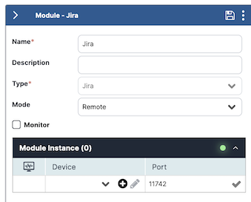
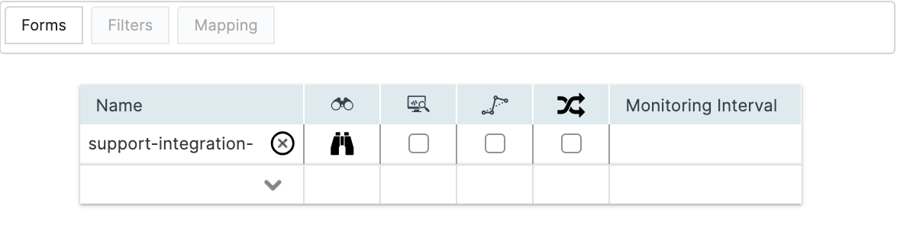
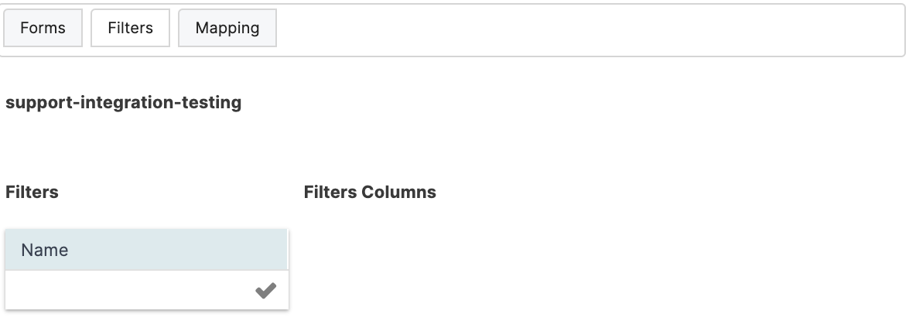
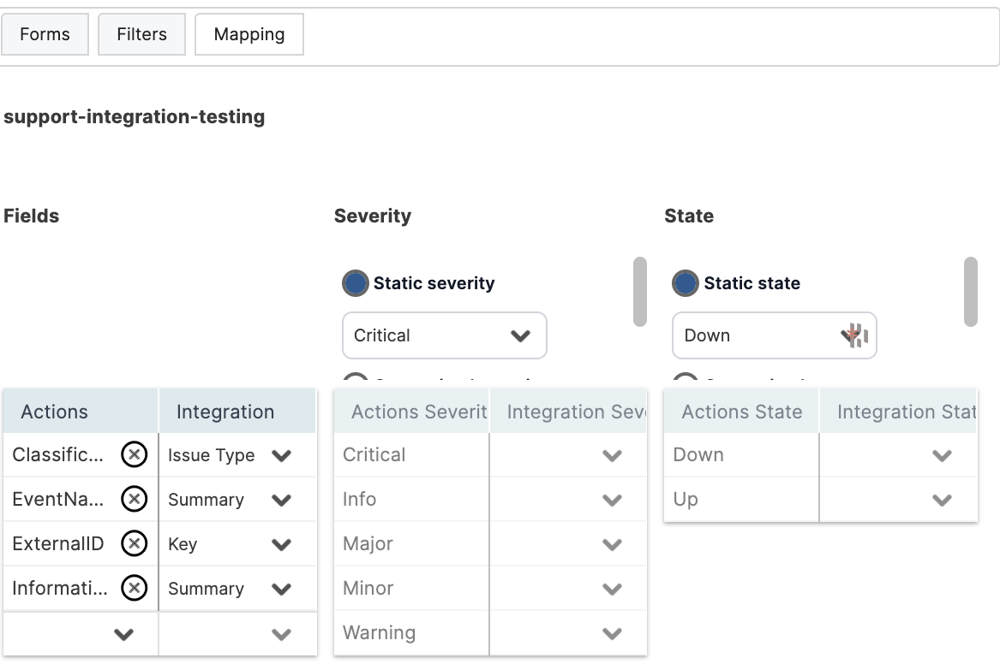
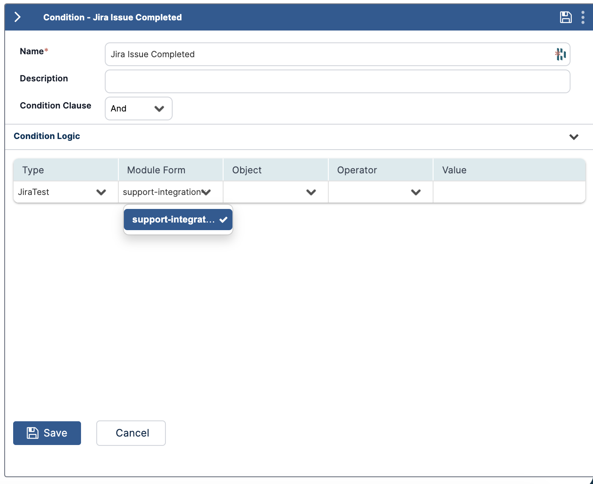
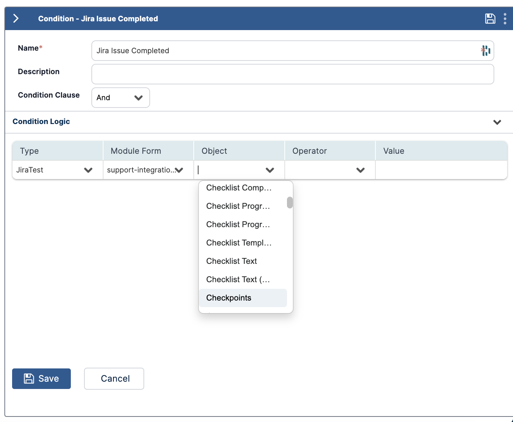
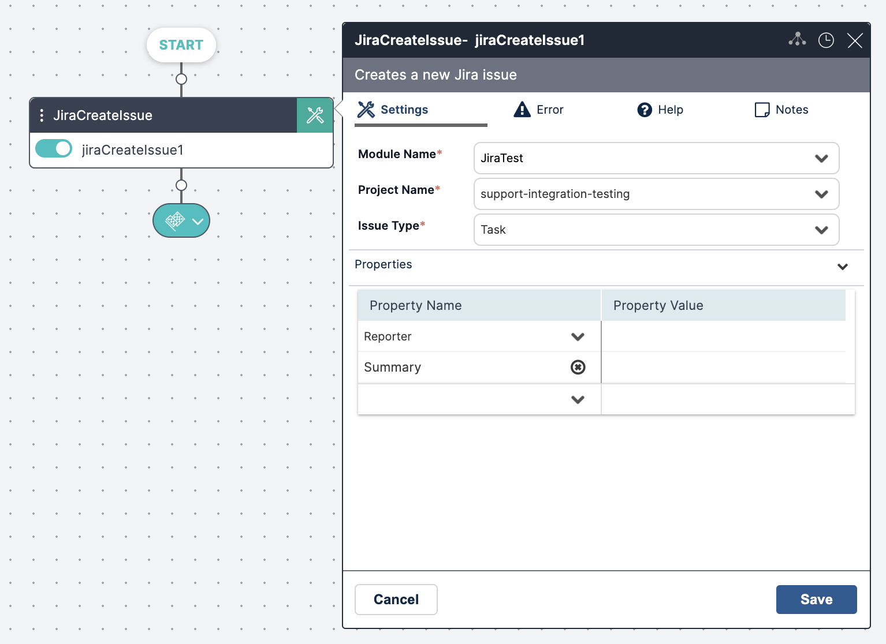

The Jira Module provides a bidirectional communication channel between Jira and VAR::PRODUCT_FULL. After you add and configure the module, VAR::PRODUCT pulls new submitted issues and updates, translates them into incidents, and displays them in the VAR::PRODUCT Dashboard. Issues closed in the Jira console trigger incident closure in VAR::PRODUCT.

## Prerequisites

The following provisions must be made before configuring the module.

### Authentication

VAR::PRODUCT supports token-based Jira authentication.

For more information, see the Jira documentation on [managing API tokens](https://support.atlassian.com/atlassian-account/docs/manage-api-tokens-for-your-atlassian-account/).

### User Access

The VAR::PRODUCT Jira integration module user must have the following Jira permissions for the projects that will be controlled by the module:

* **Administrator**—Must be able to configure and manage the Jira project.
* **Member**—Must be able to perform actions on the issues included in the Jira project.

### Server Clock Synchronization

The clock on the Jira server machine must be in sync with the clock on the machine where the module is running. Depending on the module mode (**Cloud** or **Remote**), this could be the main VAR::PRODUCT machine or another machine.

## Creating the Module Instance

You need to configure a module instance for each Jira server that you want to integrate with.

1. Go to **Main Menu > Configuration > Integrations and Modules**.
2. From the top right corner of **Integrations**, click **+**.  
   The module properties screen appears.
3. In the **Name** field, enter a name for the new module instance.  
   It is a good practice to provide a descriptive name to let you distinguish between multiple module instances of the same type.
4. (optional) In the **Description** field, enter a description for the module instance.
5. From the **Type** field, select **Jira**.
6. In **Mode**, select where you want the module instance to run:
    * **Cloud**—The module instance will run in your cloud instance of VAR::PRODUCT. This option is suitable for integration with services that run in the cloud or on-premises services that are accessible from the cloud.
    * **Remote**—In hybrid clouds, the module instance will run on the on-premises server where you installed the VAR::PRODUCT [hybrid components](../../../../Getting-Started/Setting-Up-Hybrid-Components/setting-up-hybrid-components.mdx) option is suitable for integration with services that run on-premises in a hybrid environment and are not accessible from the cloud. 
7. Check **Monitor** if you want VAR::PRODUCT to monitor the module instance.  
   By selecting this option, a new incident is created when the instance is down.
8. (**Mode: Remote** only) When you have one or more Jira integration installed on remote machines, you can select to which remote Jira module you want to connect. Select the device where the module instance is installed from **Module Instance > Device**, as well as the **Port** through which it will communicate.
   
    * If you haven't predefined a [Device](../../../Repository/Incident-Configuration/Devices.mdx#adding-devices) within **Incident Configuration**, you can click the plus icon to add a new Device directly from this screen. Enter a **Name** and an **IP Address** within the configuration, where the **Name** must be resolvable within DNS (FQDN) or IP Address.
9. Click **Save** to create the module.
10. In the **Connection Parameters** section, specify the Jira server connection details:
    1. In the **URL** field, enter the URL of the Jira instance that you are connecting to:
        * For a locally installed Jira instance, use a URL of the type `http://<server-name>:8080/rest/api/latest/`.
        * For a Jira instance installed in the cloud, use a URL of the type `https://<site-name>.atlassian.net/rest/api/latest/`.
    2. Enter the **User Email** of the user account with which you want to connect.
    3. Enter the **API Token** of the user account with which you want to connect.
    4. Click **Test Connection** to verify your connection with the server.  
       A valid connection is indicated with a green tick icon.
11. Click **Save** again to complete this section of the configuration.
12. In the **Configuration Options** section, specify additional generic module instance options:
    * **Log Level**—Select how verbose you want the module-related log messages to be. Level 1 is the least verbose.
      The log file is located in the module's installation folder (`C:\Program Files\Resolve\Actions Express Jira` by default).
13. Click **Save**.

## Selecting Jira Projects

Once the Jira module has been fully defined, you can begin to import Jira project information, as well as define their filters and mapping options.

Click the expand icon () in the module configuration screen.

The **Forms**, **Filters**, and **Mapping** tabs appear, displaying the available Jira forms and properties. Each form corresponds to a Jira project.

New Jira issues are pulled into VAR::PRODUCT according to the projects listed in the **Forms** tab and the defined [filters](#applying-filters). Issues of projects that do not appear in the list are not pulled.

1. To add a new project to the list, click in an empty row in the **Name** column and select it from the list of available projects.
2. To discover all fields associated with the selected project, click the discover icon that appears next to its name after selecting it.

:::note
A project must contain at least one issue to appear in the drop-down list. Empty projects will not be discovered.
:::

:::note
To select the *Filters* and *Mapping* tabs, click the name of the integration.
:::

3. Check the box in the **Monitoring** column if you want VAR::PRODUCT to monitor data in this project and create events for detected Jira updates.
4. Checking **Bypass Incident** will process VAR::PRODUCT events (records and updates) without creating incidents. Depending on your specific needs, this can be useful when the incoming information is not critical, and you simply want to use it in workflows.
5. Check **Execute Workflow on Every Update** to run the corresponding workflow upon each update of the incident, or clear to run it only upon the first instance.
6. In a high-volume environment, we recommend setting the **Monitoring Interval** value between 30 and 60, meaning that VAR::PRODUCT will check for Jira updates every 30 to 60 seconds. By default, it is set to 10.
7. Once you have configured the project form, click **Save** to update the module settings.

## Applying Filters

Filters determine which issues are forwarded from Jira to VAR::PRODUCT. To get all issues of a specific project, do **not** create any filters.

1. While still in the **Forms** tab, click on the desired project to select it.
2. Click the **Filters** tab.
3. In the **Name** column, enter the name of the filter you want to create and hit **Enter** or click the check mark. This name should be indicative of the criteria defining the filter. Here, we want to filter based on **Priority**.
   
4. In the **Filter Columns** table:
    1. In the **Name** column, select one of the discovered Jira project fields on which to base the filtering. Since this is a Priority filter, we will select the `Priority` field in Jira.
    2. In **Relation**, select the type of relationship you want in the filter. The possible values here will vary based on the selected relation type.
    :::note
    Numeric value fields such as `_Severity` can only have an `Equals/Not equals` relation. `Contains/Not contains` is not supported.
    :::
    3. In **Value**, choose the values you want to capture. For example, if we want to get all high-priority Jira issues, we will set this filter to `High`.

:::note
If the filter refers to a property that was not set in the Jira issue (the property is empty), the issue will not be pulled.
:::

## Mapping Jira Fields

In the **Mapping** tab, you can translate Jira properties into VAR::PRODUCT variables and objects. The window is divided into three sections: **Fields**, **Severity**, and **State**.

### Fields

In this section, you can translate Jira properties into VAR::PRODUCT variables. The Jira properties list (the **Integration** column) is updated automatically based on the [discovery completed in the **Forms** tab](#selecting-jira-projects).

To remove a field, click the **X** icon next to its name. To add a new field, click the down arrow in the empty row.

### Severity

In this section, you can translate Jira severities into VAR::PRODUCT severities. There are two options for severity selection:

* **Static Severity**—All issues of the specific project open an VAR::PRODUCT incident with the selected static severity.
* **Customized Severity**—Issues of the specific project open an VAR::PRODUCT incident according to the selected project field and its values. The possible fields in this category are all fields in the specific project that are part of a list (drop-down list/radio buttons).  

An VAR::PRODUCT severity can be mapped into several Jira severities. For example, if you want all Highest and High Jira issues to be opened as Critical incidents in VAR::PRODUCT, check the High and Highest options in the **Jira Integration Severity** field:

You can also type values manually instead of selecting them from the drop-down menu. The manually entered values must exist in the drop-down list and are case-sensitive.

### State

In this section, you can translate Jira statuses into VAR::PRODUCT states. There are two options for state selection:

* **Static State**—All issues of the specific project open an VAR::PRODUCT incident with the selected static state.
  :::note
  When using a static state, closing the issue in Jira does not close the VAR::PRODUCT incident, and vice versa.
  :::
* **Customized State**—Issues of the specific project open an VAR::PRODUCT incident according to the selected project field and its values. The possible fields in this category are all fields in the specific project that are part of a list (drop-down list/radio buttons).  
  An VAR::PRODUCT state can be mapped into several Jira statuses. For example, if you want all To Do and In Progress Jira issues to be opened as Down incidents in Actions, check the To Do and In Progress options in the Jira **Integration State** field or type them in manually.

:::note
When more than one mapping option is selected for the Up state, closing the incident in the VAR::PRODUCT LIVE Dashboard changes the selected property to the first option in the list.
:::

## Using Jira Variables

In the Jira module, related variables are discovered in VAR::PRODUCT and can be used to define conditions or to configure an activity.

Because some integration variable names (such as `Source`, `State`, and `Severity`) are reserved words in VAR::PRODUCT, they display with an added underscore (for example, `_Severity`). Keep the underscore when referencing such variables in an activity (for example, `%_Severity%`).

### In a Condition

To use Jira variables in a condition:

1. In the Main Menu > **Repository > General > Conditions** list, click the condition name and open its configuration panel on the right.
2. In the **Type** column, select the name of the Jira module from the list.
3. In the **Module Form** column, select the relevant form name to discover its fields. You can add as many form entries as needed.  
   
   All imported Jira variables will appear in the **Object** list.  
   
4. If you add the form to the condition and the **Condition Clause** field is set to "And", only fields from the specified form will match the condition.

### In an Activity

To use Jira variables in an activity:

1. In the Main Menu > **Builder > Workflow Designer**, open the activity settings.
2. In the desired field, type `%`. This will open the variable menu.
3. You can either continue to type the variable name if you know it, or click on the **Integrations and Modules** tab, find the Jira module and select the variable you want to use.
   

## Troubleshooting Jira Cloud

Use this information to resolve common issues that may occur with this integration module.

### No Response to Query Containing Special Characters or Whitespaces

* When using special characters like a dash (`-`), they must be escaped with double backslash (``\\``).
* When using `-` with whitespace surrounding it, Jira will exclude the string after the dash. For example, `location ~ "Seattle - East"` will search for values that contain `Seattle` and don't contain `East`. 

## Related Activities

To use the VAR::PRODUCT Jira activities, open the **Workflow Designer** in the Main Menu **Builder** section. Search, browse, or click the **+** in the canvas area to find the desired activity and add it to the workflow.

The following Jira activities are available:

* [Jira Create Issue Activity](../../../../Activity-Repository/Jira/jira-create-issue.mdx)
* [Jira General Command Activity](../../../../Activity-Repository/Jira/jira-general-command.mdx)
* [Jira Get Issue Activity](../../../../Activity-Repository/Jira/jira-get-issue.mdx)
* [Jira Update Issue Activity](../../../../Activity-Repository/Jira/jira-update-issue.mdx)

