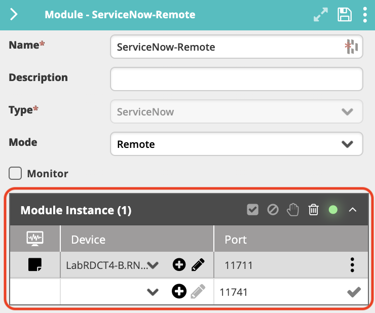
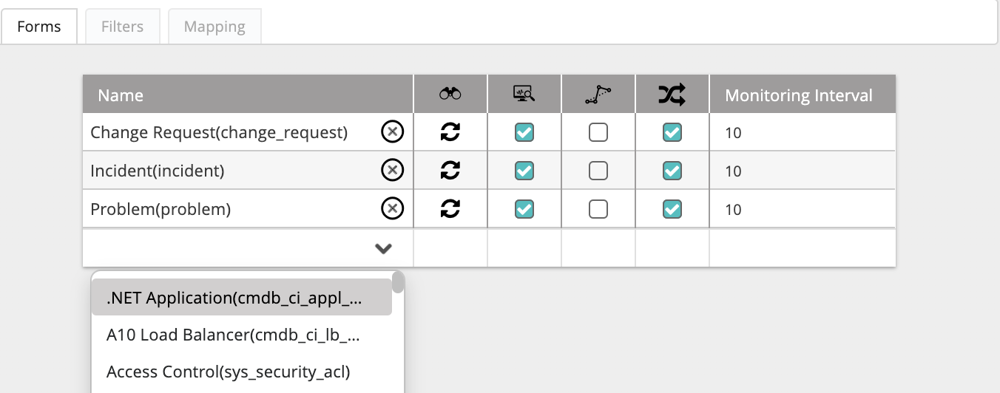
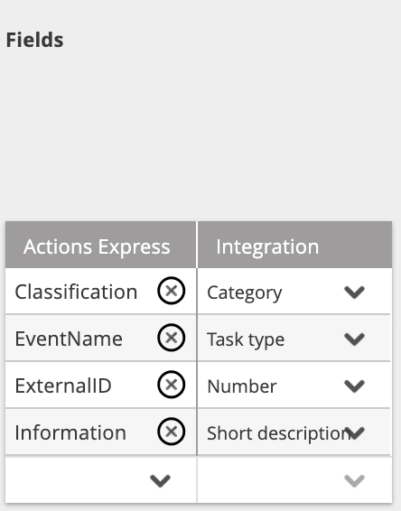
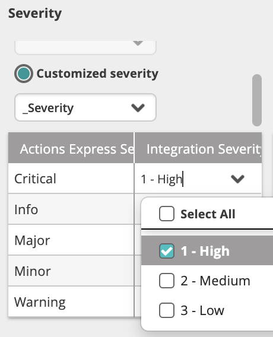
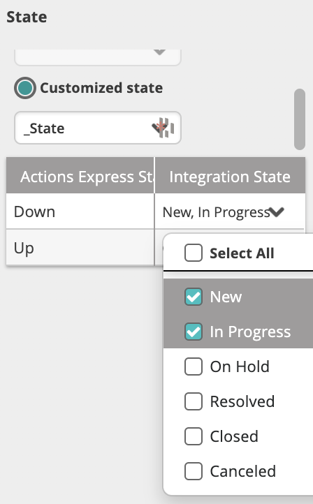
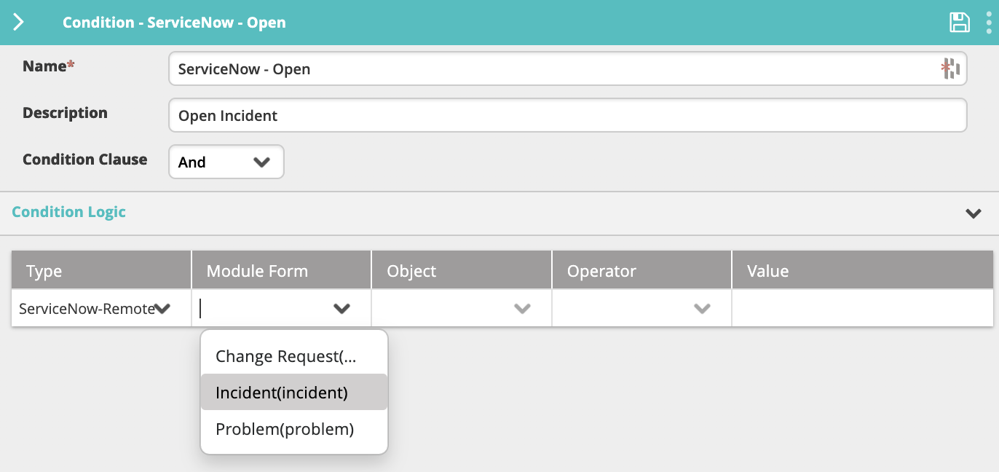
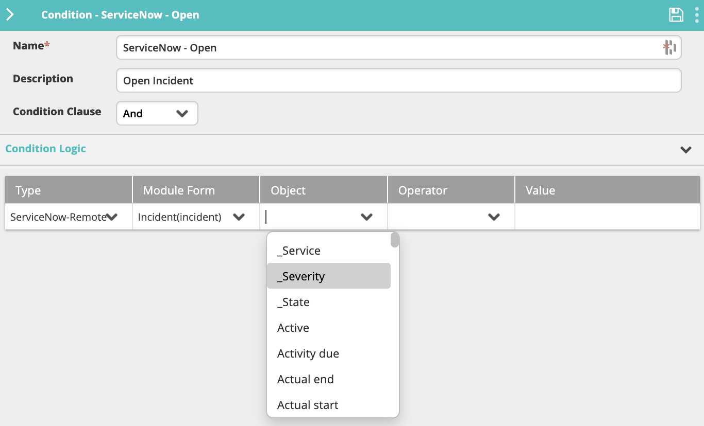
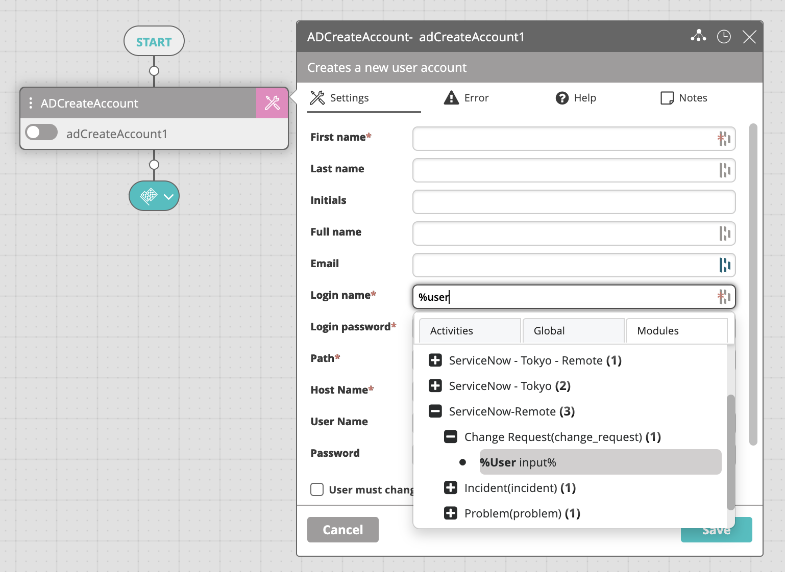

The ServiceNow Module provides a communication channel between ServiceNow and VAR::PRODUCT_FULL. After you add and configure the module, VAR::PRODUCT pulls new submitted ServiceNow records, translates them into incidents, and displays them in VAR::PRODUCT LIVE. Records closed in the ServiceNow console trigger incident closure in VAR::PRODUCT.

## Prerequisites

The following provisions must be made before configuring the module.

### User Access

The user of the integration module must have ServiceNow **admin** permissions or at minimum read access to the following ServiceNow tables and forms:

* `<target form>` (such as `incident`, `problem`, `change request`, and so on)
* `sys_choice`
* `sys_db_object`
* `sys_dictionary`
* `sys_documentation` (contains the human-readable labels and language information)
* `sys_glide_object`

For specific activity actions, additional permissions are required, from create (to create a new record using the [ServiceNow Create Record](../../../../Activity-Repository/ServiceNow/sn-create-record.mdx)activity) to write (to update an existing recording through the [ServiceNow Update Record](../../../../Activity-Repository/ServiceNow/sn-update-record.mdx) activity) as needed. Common actions with expected permissions are listed below, but should be reviewed with a ServiceNow administrator if additional permissions are required.

##### Uploading Attachment

* `sys_attachment_doc` (create)
* `sys_attachment` (create)
* `ecc_queue` (create)

The module user must be able to create in the three tables: `ecc_queue`, `sys_attachment` (to associate with the `<target form>`), and `sys_attachment_doc` (to publish the file content).

For more information, see the ServiceNow support article on [Creating attachments using Web Services](https://hi.service-now.com/kb_view.do?sysparm_article=KB0546294).

##### Downloading Attachment

* `<target form>` (such as `incident`, `problem`, and so on)
* `sys_attachment_doc` (read)
* `sys_attachment` (read)
* `ecc_queue` (read)

The module user must be able to query the `<target form>` for the `sys_id` of the record. Using the `sys_id`, you query the `sys_attachment` table to return the list of attachments currently associated with the `<target form>` (unless you know the expected file name). Then, `sys_attachment_doc` is queried to extract the file and its contents.

Populating reference field values with name in parent table for the three standard ServiceNow forms (`incident`, `problem`, and `change request`):

* `<target form>` (`incident`, `problem`, `change request`)
* `sys_user` (read)—Used to translate user references: Caller, Assigned To, Opened by.
* `sys_user_group` (read)—Used to translate assignment group reference: Assignment group.
* `cmdb_ci` (read)—Used to translate a configuration item reference.

### Authentication

The ServiceNow module can be used with two types of connection authentication to ServiceNow—Basic and OAuth. From a security standpoint, OAuth is the recommended mechanism, as it allows you to use ServiceNow activities in VAR::PRODUCT without providing your password.

### Server Clock Synchronization

The clock of the ServiceNow user account machine must be in sync with the clock on the machine where the module is running. Depending on the module mode (**Cloud** or **Remote**), this could be the main VAR::PRODUCT machine or another machine.

### Network Connectivity

Each VAR::PRODUCT instance running a ServiceNow module must have external Internet access to the configured ServiceNow instance/URL. If required, you might also have to update the module configuration to connect via a [proxy](#proxy-settings).

## Creating the Module Instance

You need to configure a module instance for each ServiceNow server that you want to integrate with.

1. Go to **Main Menu > Configuration > Integrations and Modules**.
2. From the top right corner of **Integrations**, click **+**.  
   The module properties screen appears.
3. In the **Name** field, enter a name for the new module instance.  
   It is a good practice to provide a descriptive name to let you distinguish between multiple module instances of the same type.
4. (optional) In the **Description** field, enter a description for the module instance.
5. From the **Type** field, select **ServiceNow**.
6. In **Mode**, select where you want the module instance to run:
    * **Cloud**—The module instance will run in your cloud instance of VAR::PRODUCT. This option is suitable for integration with services that run in the cloud or on-premises services that are accessible from the cloud.
    * **Remote**—The module instance will run on the server where you installed the remote executor (installing a remote executor is needed when the server does not have access to the SQL DB). This option is suitable for integration with services that run in a separate network and are normally not accessible from the main network where VAR::PRODUCT runs.
7. Check **Monitor** if you want VAR::PRODUCT to monitor the module instance.  
   By selecting this option, a new incident is created when the instance is down.
8. When you have one or more ServiceNow integration installed on remote machines, you can select to which remote ServiceNow module you want to connect. Select the device where the module instance is installed from **Module Instance > Device**, as well as the **Port** through which it will communicate.
   
    * If you haven't predefined a [Device](../../../Repository/Incident-Configuration/Devices.mdx#adding-devices) within **Incident Configuration**, you can click the plus icon to add a new Device directly from this screen. Enter a **Name** and an **IP Address** within the configuration, where the **Name** must be resolvable within DNS (FQDN) or IP Address.
9. Click **Save** to create the module.
10. In the **Connection Parameters** section, specify the ServiceNow server connection details:
    1. In the **URL** field, enter the URL of the ServiceNow instance.
    2. Select the authentication type to use:
        * **Basic** to log in with a ServiceNow username and password.
        * **OAuth2** to log in with an OAuth authentication token.
    3. In the **User name** and **Password** fields, enter the credentials of the ServiceNow user account authorized to access the ServiceNow instance as described in [User Access](#user-access).
    4. (OAuth only) Enter the **Client ID** and **Client Secret** obtained from ServiceNow.  
        For more information, see [Set up OAuth](https://docs.servicenow.com/bundle/tokyo-platform-security/page/administer/security/task/t_SettingUpOAuth.html).
    5. (Optional) Set up a [proxy server](#proxy-settings) for the connection:
        * Check **Use Proxy**.
        * In **Proxy URL**, enter the URL of the proxy server.
        * In **Proxy Username**, enter the username of a proxy server user account if the server requires authentication.
        * In **Proxy Password**, enter the password of the proxy user account.
    6. Click **Test Connection** to verify your connection with the server.  
       A valid connection is indicated with a green tick icon.
11. Click **Save** again to complete this section of the configuration.
12. In the **Configuration Options** section, specify additional generic module instance options:
    * **Log Level**—Select how verbose you want the module-related log messages to be. Level 1 is the least verbose.
      The log file is located in the module's installation folder (`C:\Program Files\Resolve\Actions Express ServiceNow` by default).
13. Click **Save**.

### Proxy Settings

If accessing the ServiceNow instance requires a proxy server, the credentials must be configured at the VAR::COMPANY DB level. Contact your Resolve representative for assistance with this.

## Selecting ServiceNow Records

Once the ServiceNow module has been fully configured, you can begin to import ServiceNow form information, as well as define filters and mapping options.

Click the expand icon () in the module configuration screen.

The **Forms**, **Filters**, and **Mapping** tabs appear, displaying the available ServiceNow forms and properties. Each form corresponds to a ServiceNow record such as a task or an incident.

New ServiceNow records are pulled into VAR::PRODUCT according to the forms listed in the **Forms** tab and their defined filters. Records of forms that do not appear in the list are not pulled.

1. To add a new form to the list, click in an empty row in the **Name** column and select it from the list of available forms.
   
2. To discover all fields associated with the selected form, click the discover icon that appears next to its name after selecting it ().
   Once discovery is complete, the icon will change to circular arrows to indicate this.
3. Check the box in the **Monitoring** column () if you want VAR::PRODUCT to monitor data in this form and create events for detected ServiceNow updates.
4. Checking **Bypass Incident** () will process VAR::PRODUCT events (records and updates) without creating incidents. Depending on your specific needs, this can be useful when the incoming information is not critical, and you simply want to use it in workflows.
5. Check **Execute Workflow on Every Update** () to run the corresponding workflow upon each update of the incident, or clear to run it only upon the first instance.
6. In a high-volume environment, we recommend setting the **Monitoring Interval** value between 30 and 60, meaning that VAR::PRODUCT will check for ServiceNow updates every 30 to 60 seconds. By default, it is set to 10.
7. Once you have configured the form, click **Save** to update the module settings.

## Applying Filters

Filters determine which ServiceNow records will be discovered by VAR::PRODUCT. To get all requests for a specific record, do **not** create any filters.

1. While still in the **Forms** tab, click on the form you want to select.
2. Click the **Filters** tab.
3. In the **Name** column, enter the name of the filter you want to create and hit **Enter** or click the check mark. This name should be indicative of the criteria defining the filter.
4. In the **Filter Columns** table:
    1. In the **Name** column, select one of the discovered ServiceNow record fields on which to base the filtering.
    2. In **Relation**, select the type of relationship you want in the filter. The possible values here will vary based on the selected relation type.
       :::note
       Numeric value fields such as `_Severity` can only have an `Equals/Not equals` relation. `Contains/Not contains` is not supported.
       :::
    3. In **Value**, choose the values you want to capture.

## Mapping ServiceNow Properties

In the **Mapping** tab, you can translate ServiceNow properties into VAR::PRODUCT incidents. The window is divided into three sections: **Fields**, **Severity**, and **State**.

### Fields

In this section, you can translate ServiceNow properties into VAR::PRODUCT variables. The ServiceNow properties list (the drop-down in each row of the **Integration** column) is updated automatically based on the [discovery completed in the **Forms** tab](#selecting-servicenow-records).

To remove a field, click the **X** icon next to its name. To add a new field, click the down arrow in the empty row.

### Severity

In this section, you can translate ServiceNow severity into VAR::PRODUCT severity. There are two options for severity selection:

* **Static Severity**—All records of the specified form open an VAR::PRODUCT incident with the selected static severity.
* **Customized Severity**—Enables you to map the values of a specified field of the ServiceNow record against the VAR::PRODUCT severity. The possible fields in this category are all fields in the specific record that are part of a list (drop-down list/radio buttons).

An VAR::PRODUCT severity can be mapped into several ServiceNow severity values. For example, if you want all ServiceNow severity values of 1 to be opened as Critical incidents in VAR::PRODUCT, check the "1 - High" option in the **Integration Severity** field:

You can also type values manually instead of selecting them from the drop-down menu. The manually entered values must exist in the drop-down list and are case-sensitive.

### State

In this section, you can translate ServiceNow states into VAR::PRODUCT states. There are two options for state selection:

* **Static State**—All records of the specified form open an VAR::PRODUCT incident with the selected static state.
  :::note
  When using a static state, closing the request in ServiceNow does not close the VAR::PRODUCT incident, and vice versa.
  :::
* **Customized State**—Records of the specified form open an VAR::PRODUCT incident according to the selected form field and its values. The possible fields in this category are all fields in the specified form that are part of a list (drop-down list/radio buttons).  
  An VAR::PRODUCT state can be mapped into several ServiceNow states. For example, if you want all New and In Progress ServiceNow records to be opened as Down incidents in VAR::PRODUCT, check the "New" and "In Progress" options in the ServiceNow **Integration State** field or type them in manually.  
    

:::note
When more than one mapping option is selected for the Up state, closing the incident in the VAR::PRODUCT LIVE Dashboard changes the selected property to the first option in the list.
:::

## Using ServiceNow Variables

In the ServiceNow module, related variables are discovered in VAR::PRODUCT and can be used to define conditions or to configure an activity.

Because some integration variable names (such as `Source`, `State`, and `Severity`) are reserved words in VAR::PRODUCT, they display with an added underscore (for example, `_Severity`). Keep the underscore when referencing such variables in an activity (for example, `%_Severity%`).

### In a Condition

To use ServiceNow variables in a condition:

1. In the Main Menu > **Repository > General > Conditions** list, click the condition name and open its configuration panel on the right.
2. In the **Type** column, select the name of the ServiceNow module from the list.
3. In the **Module Form** column, select the relevant form name to discover its fields. You can add as many form entries as needed.  
   
   All imported ServiceNow variables will appear in the **Object** list.  
   
4. If you add the form to the condition and the **Condition Clause** field is set to "And", only fields from the specified form will match the condition.

### In an Activity

To use ServiceNow variables in an activity:

1. In the Main Menu > **Builder > Workflow Designer**, open the activity settings.
2. In the desired field, type `%`. This will open the variable menu. 
3. You can either continue to type the variable name if you know it, or click on the **Integrations and Modules** tab, find the ServiceNow module and select the variable you want to use.

## Troubleshooting

Use this information to resolve common issues that may occur with this integration module.

### Integration Is Down

If the ServiceNow module is down, open its configuration window from the Main Menu > **Configuration > Integrations and Modules** and click **Test Connection**.

* If the test is successful: Verify that the Integrations and Modules section of your license contains "ServiceNow".
* If the test fails: Continue troubleshooting according to the next sections.

### Integration Is Not Pulling New Events

If the integration is in Up state but no new alerts are being pulled:

* Verify that the specified form was added to the **Forms** tab of the integration configuration.
* In the form that the integration is listening to, verify that label names are not duplicated.

### New Events from ServiceNow Are Not Mapped to VAR::PRODUCT Incidents

If you see new events in the VAR::PRODUCT Audit Trail but no new incidents are created in the VAR::PRODUCT Live dashboard:

* Verify that all ServiceNow fields required for the mapping in the module configuration's **Mapping** tab are sent with data from ServiceNow and aren't sent empty. To do this, open the ServiceNow log located under `C:\Program Files\Actions Express\Actions Express ServiceNow Server\<tenant-name>\<instance-name>\Logs` and search for the incoming messages.

### Test Connection Failure

* **Error**: "Could not connect to net.tcp://ServerName: 11020./ The connection attempt lasted for a time span ...".

  where [ServerName] is the device you have listed in the general settings configuration.

    * **Probable cause and resolution**: The ServiceNow module is not installed on [ServerName], or the service is not running. If the specified server is incorrect, select the correct server where the component is installed. If the server name is correct, start the service (or restart it if it is already started). If the service doesn't exist, install it on the selected server.

* **Error**: "The remote name could not be resolved".
    * **Probable cause and resolution**: Verify that the URL you have provided is correct and reachable from the VAR::PRODUCT server.

* **Error**: "Unable to connect ServiceNow The underlying connection was closed: Could not establish trust relationship for the SSL/TLS secure channel”.
    * **Probable cause and resolution**: VAR::PRODUCT server is missing an Entrust certificate. Download and install Entrust.net Certificate Authority (2048).

* **Error**: "The request failed with HTTP status 401: Unauthorized"
    * **Probable cause and resolution**: Verify that the username and password you have provided are valid and have sufficient permissions to log in to ServiceNow.

Activities: Create Record, Update Record, Get Record

* **Error**: Activity returns "Unable to communicate with ServiceNow Module" error.

    * **Probable cause and resolution**: The ServiceNow module is in status Down. Check Troubleshooting section [Module is Down](#integration-is-down).

